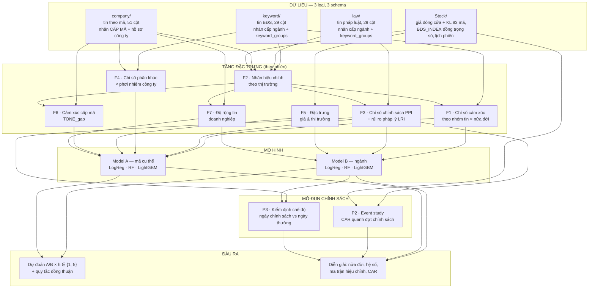
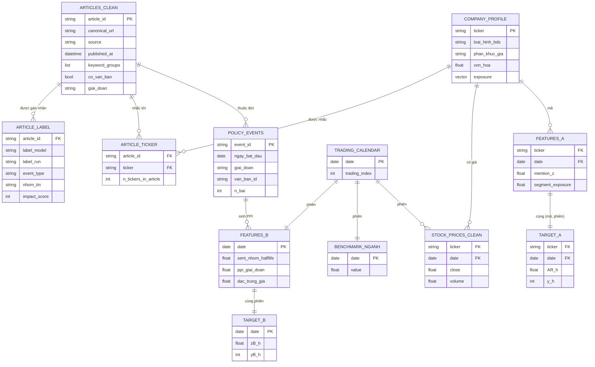
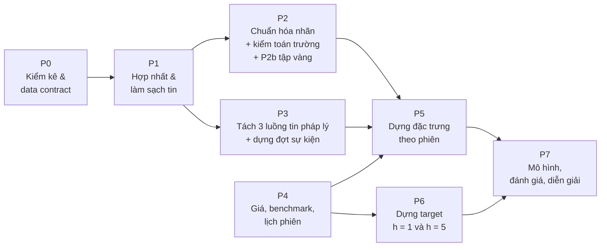
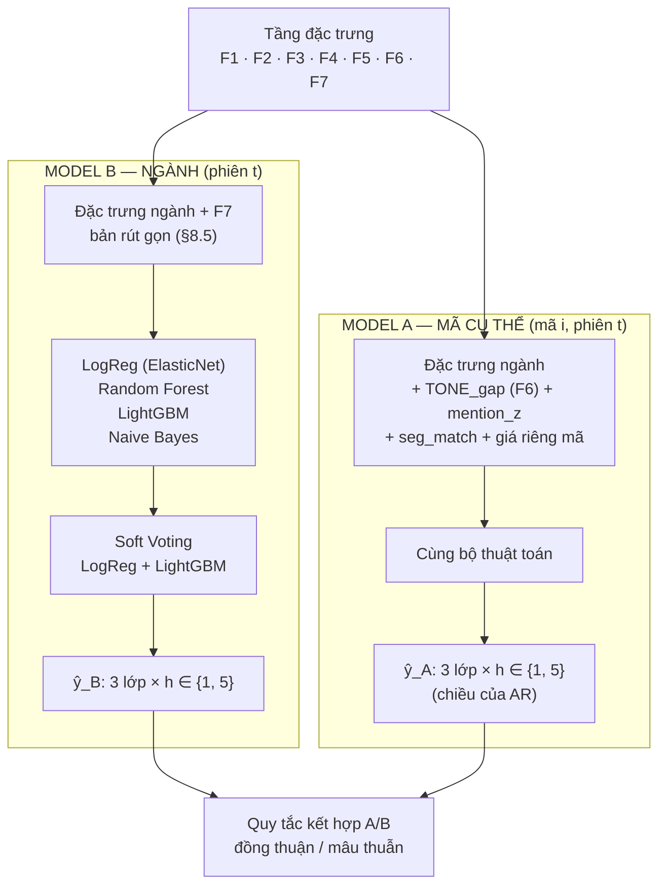
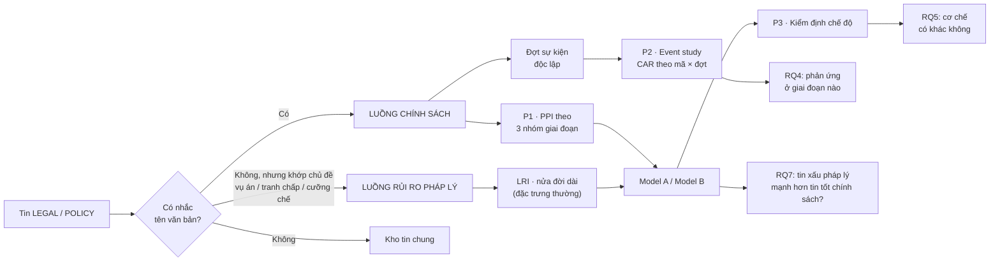
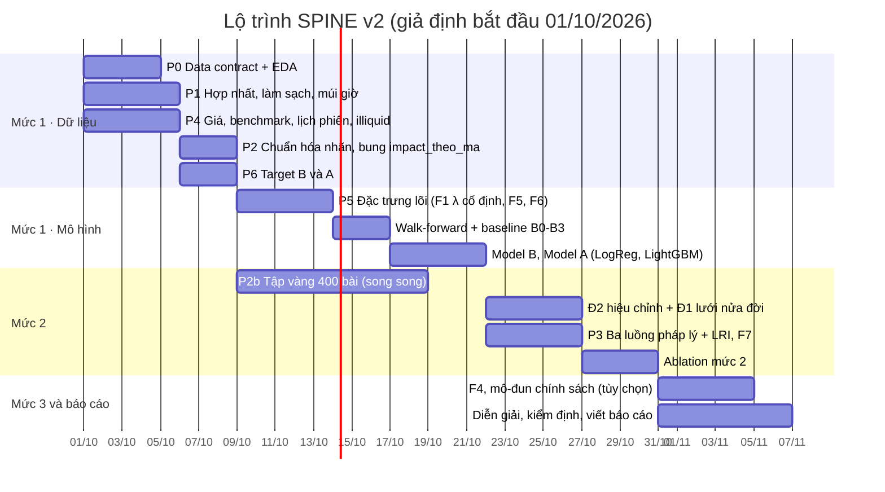
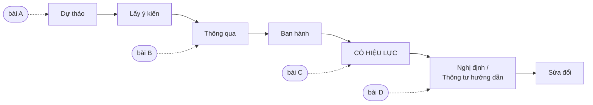

# SPINE — Thiết kế chi tiết từ Dữ liệu đến Mô hình

**SPINE** = *Sentiment & Policy Index for News-driven Equities*.

**Dự án:** BDS-News-Stock-Impact-Predictor — phân tích và dự báo tác động của tin tức lên cổ phiếu bất động sản Việt Nam (mã cụ thể & toàn ngành), từ góc nhìn của nhà đầu tư nhỏ lẻ đọc báo.

> **Nguyên tắc thiết kế.** Cỡ mẫu quyết định độ phức tạp cho phép, không phải ngược lại. Cỡ mẫu ở cấp phiên chỉ 666 phiên, số đợt sự kiện chính sách độc lập khoảng một trăm, và nhãn cấp mã chỉ có ở `company/`. Vì vậy SPINE dùng **mô hình bảng diễn giải được** ở phần dự đoán, và dồn tính mới vào **tầng đặc trưng** cùng **mô-đun chính sách**. Mọi câu hỏi cần độ mạnh thống kê đều được đặt ở cấp có cỡ mẫu lớn: (mã × phiên) và (mã × đợt sự kiện).

> **Phiên bản 2 (29/09/2026): thiết kế theo dữ liệu chốt.** Dữ liệu dự án đã chốt: toàn bộ tin nằm trong `data final/`, giá nằm trong file giá sẵn có, và **không thu thập thêm**. Mọi con số trong tài liệu này được đo trên dữ liệu thật đó, không còn là số của tập demo. Bản trước được lưu tại `_luu_tru/thiet_ke_cu/SPINE_Thiet_Ke_Chi_Tiet_backup_truoc_data_final.md`.

> **Phiên bản 2.1 (29/09/2026): bổ sung thư mục `data final/Stock/`** gồm file giá (giống hệt bản cũ) và **bảng trust score** CafeF/Kenh14. Mục §0.3 và §3.8 ghi lại kết quả kiểm toán bảng trust score và các điều chỉnh thiết kế đi kèm. Mục §18 liệt kê các bài báo khoa học làm căn cứ cho từng quyết định thiết kế.

> **Phiên bản 3 (30/09/2026): hệ thống phân tích tin BĐS 4 tầng, lấy góc nhìn NHÀ ĐẦU TƯ NHỎ LẺ làm trung tâm.** Sau khi xác nhận tin tức không cải thiện dự báo chiều giá phiên sau (T25, T26), dự án đặt lại câu hỏi theo cách một nhà đầu tư cá nhân thực sự dùng tin: *"đọc tin xong, có nên làm theo không?"*. Xem §0.4 và các dòng T27–T31.

---

## 0. Nhật ký thay đổi v2: thiết kế lại theo dữ liệu chốt

### 0.1. Nguồn dữ liệu chính thức

| Loại | Vị trí | Quy mô đo được |
|---|---|---|
| Tin BĐS (`keyword/`) | `data final/keyword/{cafef,kenh14,vietstock}` | 14.956 bài duy nhất |
| Tin pháp luật (`law/`) | `data final/law/*_classified.csv` | 21.695 bài duy nhất |
| Tin theo mã (`company/`) | `data final/company/*/label/*_classified.csv` | 22.871 bài, 47.972 dòng (bài × mã), 83 mã |
| **Tổng tin sau khử trùng chéo** | | **47.272 bài**, 01/01/2024 → 09/09/2026; CafeF 70,8%, Vietstock 24,4%, Kenh14 4,8% |
| Giá & hồ sơ công ty | `data final/Stock/Company_Profile_BDS_REAL_DATA__1_.xlsx` (giống hệt bản trong `kw_unzip/`) | 83 mã × 668 phiên (02/01/2024 → 11/09/2026), **chỉ giá đóng cửa + khối lượng**, kèm chuỗi `BDS_INDEX` |
| Bảng trust score | `data final/Stock/Bang_Trust_Score_CafeF_Kenh14.xlsx` | 6.583 dòng (bài × mã) trên 10 mã và 1.690 bài cấp ngành; chỉ CafeF + Kenh14; horizon 5 phiên. **Không dùng trực tiếp làm đặc trưng** — xem §3.8 |

Giá đóng cửa là lựa chọn có chủ đích, vì câu hỏi nghiên cứu là biến động giá **giữa các phiên** (close-to-close).

### 0.2. Những thay đổi và bằng chứng

| # | Thiết kế cũ | Dữ liệu thật cho thấy | Thiết kế mới | Mục |
|---|---|---|---|---|
| T1 | Giá OHLCV từ 01/2023 để ước lượng β 250 phiên | Giá bắt đầu 02/01/2024, chỉ có giá đóng cửa | AR điều chỉnh theo ngành với **β = 1**; β mở rộng dần (tối thiểu 120 phiên) chỉ làm kiểm tra độ vững từ 2024Q3. Bỏ đặc trưng biên độ high–low | §7.6, §8.2 |
| T2 | Benchmark trọng số vốn hóa | VIC tăng +1006%; VIC+VHM chiếm 42% → **85%** vốn hóa ngành; chỉ số vốn hóa tương quan 0,95 với riêng VIC+VHM | Benchmark **đồng trọng số**; `BDS_INDEX` có sẵn khớp chỉ số đồng trọng số (tương quan 1,00) | §4, §8.1 |
| T3 | VN-Index cho event study và F5 | Không có VN-Index | Event study dùng **mô hình lợi suất trung bình**; hồi quy chéo dùng AR theo ngành | §9.2 |
| T4 | Luồng rủi ro pháp lý "mỏng, ~0,3 bài/phiên" | **5,45 bài/phiên**; tỷ lệ nhãn âm 32,7%, so với 3,6% ở luồng chính sách | Nửa đời của `LRI` được thử cả mức ngắn | §3.5, §7.4 |
| T5 | Ngày chính sách = ngày có ≥ 2 bài chính sách | Quy tắc này biến **73% số phiên** (485/666) thành ngày chính sách | Ngưỡng **k = 5** bài/phiên: 173 ngày (26%), **108 đợt**; đường cong CAR dùng các đợt bất thường (z ≥ 2,5: 26 đợt) | §6 P3, §9 |
| T6 | Ánh xạ phân khúc dùng `chung_cu`, `khu_cong_nghiep`, `bds_dat`… | `chung_cu` và `khu_cong_nghiep` không tồn tại; `bds_dat`, `khu_dan_cu` là nhóm pháp lý/chung quá rộng | Bảng ánh xạ mới theo từ vựng thật | §7.5 |
| T7 | Model A "hàng chục nghìn cặp" | 16.188 cặp (mã, phiên) có tin cùng phiên; **34.411 cặp** với cửa sổ [t−5, t] | Giữ cửa sổ [t−5, t] | §8.2 |
| T8 | Walk-forward 6 fold, fold đầu train 2 quý | Quý 2024Q1 dùng hết cho khởi động (σ 60 phiên, nửa đời 20) | Test 2025Q2 → 2026Q3 (**6 fold, 360 phiên**), validation 1 quý | §11.1 |
| T9 | So sánh mô hình bằng Wilcoxon theo fold | Với 6 fold, Wilcoxon hai phía chỉ đạt p < 0,05 khi **cả 6 fold** cùng chiều | Kiểm định chính là Diebold–Mariano và bootstrap theo khối trên dự đoán test gộp | §11.3 |
| T10 | `size_bucket` lấy từ cột `Von_hoa_thi_truong_ty_VND` | Cột này tính bằng giá **ngày 11/09/2026**, gây rò rỉ tương lai | Vốn hóa tại phiên t = giá đóng cửa t × số CP lưu hành | §17.5 |
| T11 | Tập vàng 200–300 bài chỉ nằm trong mục rủi ro | Chỉ một LLM (qwen2.5:7b); nhãn lệch dương mạnh | Thành bước bắt buộc **P2b**: 400 bài gán tay, đo Cohen's κ | §6 P2b |
| T12 | Đ2 so dấu nhãn với dấu lợi suất | Dấu lợi suất có xu hướng (drift): nhóm Vin có 38% lớp Tăng ở h = 10 | Đ2 so với **z đã trừ trung bình train**, không so với dấu thô | §7.3 |
| T13 | Mọi mã đều như nhau | 13 mã có hơn 30% phiên giá đứng yên; 29 mã có khối lượng trung vị dưới 100 nghìn CP | Cờ `illiquid`; benchmark chính chỉ gồm mã thanh khoản; Model A báo cáo tách nhóm | §4.2, §8.2 |

Các phần **không đổi**: bài toán và RQ1–RQ8, kiến trúc 3 loại dữ liệu, công thức F1/F6/F7, Đ1–Đ4, danh sách thuật toán, nguyên tắc chống rò rỉ.

### 0.3. Cập nhật v2.1: bảng trust score và căn cứ từ văn liệu

| # | Phát hiện | Thay đổi | Căn cứ | Mục |
|---|---|---|---|---|
| T14 | File giá đã nằm trong `data final/Stock/` | Mọi đường dẫn thị trường trỏ tới `data final/Stock/` | — | §4.1 |
| T15 | Trust score của bảng mới **đo xu hướng thị trường chứ không đo độ tin cậy của nguồn**: 87% dự đoán là "Tăng", trust theo tháng tương quan **0,995** với tỷ lệ phiên tăng; trust của CafeF\|VIC (63,2%) gần bằng tỷ lệ tăng của chính VIC (61,6%); dùng số của cả kỳ cho mọi bài là rò rỉ tương lai | Không dùng làm đặc trưng. Dùng làm **(a)** phép thử đối chiếu cho quy tắc chốt phiên, **(b)** baseline B6, **(c)** bằng chứng cho Đ2 trong báo cáo | Agresti & Coull (1998); Efron & Morris (1975) | §3.8 |
| T16 | Quy tắc chốt phiên của bảng trust khớp SPINE ở 99,91% số dòng; 6 dòng lệch đều là bài đăng **đúng 14:45** | Sửa quy ước: tin đăng **từ 14:45 trở đi** tính cho phiên sau, vì lệnh ATC không còn khớp kịp | — | §7.1 |
| T17 | Gộp toàn bộ, nhãn thô chỉ hơn tỷ lệ nền 0,6–2 điểm ở h = 5 (z = 1,19) | Đ2 thêm **hiệu chỉnh riêng cho nhãn dương và nhãn âm** và **co ngót phân cấp về tỷ lệ nền** (thay trọng số W1/W2 cố định) | Tetlock (2007); Lopez-Lira & Tang (2023); Ke, Kelly & Xiu (2019) | §7.3 |
| T18 | Tập vàng chọn mẫu tùy ý thì không hiệu chỉnh được sai lệch trong hồi quy | P2b chọn mẫu **ngẫu nhiên phân tầng với xác suất chọn biết trước**, để dùng được ước lượng DSL/PPI | Egami và cộng sự (2023); Angelopoulos và cộng sự (2023) | §6 P2b |
| T19 | Số bài chính sách phụ thuộc lượng bài crawl mỗi ngày | PPI chia cho tổng số bài trong ngày, như chỉ số EPU | Baker, Bloom & Davis (2016) | §7.4 |
| T20 | Nghiên cứu trên thị trường Việt Nam thấy tin tức làm thay đổi **phương sai** nhiều hơn chiều giá | Thêm **target phụ: biến động mạnh** (\|z\| lớn), ở mức ưu tiên 2 | Vu và cộng sự (2023) | §8.1, §8.2 |
| T21 | Thanh khoản đang đo thô (tỷ lệ phiên giá đứng yên, khối lượng) | Thêm chỉ số Amihud tính từ giá đóng cửa × khối lượng | Lesmond, Ogden & Trzcinka (1999); Amihud (2002) | §7.6 |
| T22 | 108 đợt chính sách dồn sát nhau, cửa sổ chồng lấn | Kiểm định CAR dùng bản điều chỉnh tương quan chéo | Kolari & Pynnönen (2010); Kolari, Pape & Pynnönen (2018) | §9.2 |
| T23 | Chỉ 360 phiên test | Kiểm định Diebold–Mariano dùng hiệu chỉnh mẫu nhỏ HLN | Harvey, Leybourne & Newbold (1997) | §11.3 |
| T26 | Hướng B (§8.7) cho kết quả rỗng ngoài mẫu. Người dùng muốn tin tức là nguồn chính | **Hướng C**: (C1) tin tức có quyết định giá đi tiếp hay đảo chiều sau biến động mạnh; bài toán văn bản (tin trước giờ mở cửa → phản ứng trong phiên, tf-idf so với nhãn LLM); (C2) loại tin nào tác động. Kết quả: mô tả rõ, nhưng ngoài mẫu không có đóng góp dự báo riêng — xem `outputs/reports/KET_QUA_TONG_HOP.md` §3c | Chan (2003); Boudoukh et al. (2019); Tetlock (2011); Ke, Kelly & Xiu (2019) | §3c kết quả |
| T25 | Sau khi triển khai: tin tức **không** cải thiện dự báo chiều giá (RQ1 rỗng qua 5 cách cải tiến; tin chỉ đóng góp ~7% năng lực mô hình), nhưng dự báo rõ **thanh khoản và biến động phiên sau** (Rank IC 0,05–0,12, t = 7–17) | **Chuyển trọng tâm sang hướng B — "sự chú ý"** (RQ10, §8.7). Kết quả về chiều giá trở thành nửa đầu câu chuyện | Da, Engelberg & Gao (2011); Barber & Odean (2008) | §8.7 |
| T24 | 4 horizon {1, 3, 5, 10} → 16 mô hình, trùng vai trò với Đ1; h = 10 cần accuracy 61,7% mới có ý nghĩa. Khám phá trên 04/2024–03/2025: chỉ **h = 1 ở cấp mã** có tín hiệu (Rank IC +0,032, t = 2,23), từ h = 3 trở đi về 0 rồi hơi âm | **Chỉ còn 2 horizon: h = 1 (chính) và h = 5 (một tuần giao dịch)**. h = 5 kiểm định tác động ở h = 1 **kéo dài hay đảo chiều**; Đ2 hiệu chỉnh theo h = 1 | Tetlock (2007) | §1.1, §3.9, §7.3, §8 |
| T27 | Nhãn LLM chưa được kiểm chứng; LLM chậm; kho tin lẫn nhiều bình luận thị trường | **Tầng NLP**: tập vàng 300 bài (định nghĩa lấy nguyên văn prompt gốc), chưng cất nhãn LLM sang tf-idf (75% độ khớp, ~8.000 bài/giây), bộ lọc mức liên quan (41,8% là tin sự kiện DN) | Egami et al. (2023); Gilardi et al. (2023) | §0.4 |
| T28 | Tin đăng **sau** khi giá đã chạy: 10 phiên trước tin +0,74% theo hướng tin, 5 phiên sau khi giao dịch được +0,01% | **Bài toán mới "đọc tin → có nên làm theo?"** (nhà đầu tư nhỏ lẻ): target có lãi sau phí / thắng rổ BĐS, giữ 5 phiên | Barber & Odean (2008); Tetlock (2011) | §0.4 |
| T29 | "Đà tăng sau tin" của tin DN tốt (+1–2%) biến mất khi trừ xu hướng riêng của mã | Phân tích sự kiện dùng AR **trừ rổ BĐS và trừ xu hướng riêng của mã** (mean-adjusted, t−130…t−11) | MacKinlay (1997); Brown & Warner (1985) | §0.4 |
| T30 | Chọn cấu hình trên val không phân biệt được ứng viên (AUC val ≈ 0,38–0,54) | Cấu hình chính thức **chốt trước khi chạy** mỗi vòng (vòng 1: LightGBM; vòng 3: E3 kết hợp) — không chọn theo test | — | §0.4 |
| T31 | Số CP lưu hành trong hồ sơ là số hiện tại | Không dùng vốn hóa làm đặc trưng ở v3 (bỏ đi không đổi kết quả) | — | §0.4 |
| T34 | Vòng cuối trước khi đóng gói | **Mô hình FINAL** (chốt trước): E3 + trọng số thời gian; 3 chế độ khuyến nghị (tiêu chuẩn top 10%, thận trọng đồng thuận, **tự tin hai phía** = dự đoán có chọn lọc). AUC 0,599; tỷ lệ đúng 60,0 / 62,3 / 65,1% ở độ phủ 13 / 11 / 24%. Đóng gói: `src.run_all`, `requirements.txt`, dashboard, khuyến nghị tin mới nhất | Geifman & El-Yaniv (2017) | §0.4 |
| T33 | Người dùng muốn cải thiện thêm mô hình và phân tích | Vòng 4 (E4 chốt trước): 5 mô hình gồm lambdarank và CatBoost, ngữ nghĩa bài báo e5, câu chuyện, trọng số thời gian → **không vượt E3** (AUC 0,580 so với 0,588); ngữ nghĩa bài báo không thêm thông tin. Giữ E3 làm mô hình cuối. Thêm phân tích A4–A9 (nguồn, thời điểm, chế độ thị trường, thanh khoản, khối lượng, câu chuyện) | Barber & Odean (2008); Tetlock (2011) | §0.4 |
| T32 | Nhóm không có thời gian gán tập vàng; có sẵn 3.434 bài do GPT-4.1-mini gán nhãn | **Thay P2b bằng kiểm chứng nhãn nhiều chiều**: nhất quán nội bộ, LLM thứ hai, trọng tài LLM gán mù 150 bài phân tầng, từ khóa, phản ứng giá. Phát hiện: ngược chiều hiếm (2,6–4,1%), lệch dương 51–59%, qwen bỏ sót 88% tin xấu | Gilardi et al. (2023); Egami et al. (2023) | §0.4 |

### 0.4. Phiên bản 3: hệ thống 4 tầng và bài toán nhà đầu tư nhỏ lẻ

| Tầng | Thành phần | Code | Kết quả chính |
|---|---|---|---|
| **1. Dữ liệu & NLP** | Làm sạch, ánh xạ tin → phiên (chốt 14:45), nhãn LLM; tập vàng 300 bài; chưng cất nhãn; bộ lọc mức liên quan | `src/data/`, `src/nlp/` | Loại sự kiện 75,4% (đoán lớp phổ biến 22,7%), dấu sắc thái 74,9% (64,6%) |
| **2. Phân tích** | A1 báo trễ so với giá; A2 loại tin còn dư địa; A3 mô hình dựa vào gì; tin chính sách; sự chú ý | `src/analysis/` | Giá chạy trước tin; tin thị trường tốt đảo chiều −0,8%/20 phiên (t = −3,0); không loại tin nào "cứ đọc là làm theo" có lợi |
| **3. Dự báo** | Chiều giá (Model A/B); sự chú ý; **nhà đầu tư nhỏ lẻ** (vòng 1–3, 10 thuật toán); mô phỏng danh mục; độ vững | `src/models/`, `src/retail/` | E3 AUC 0,586; precision 59–64% ở top 7–14%; danh mục C +20–42% so với A −24%, B −21%; C hơn A và B ở 11/11 kịch bản |
| **4. Sản phẩm** | Dashboard "Đọc tin, có nên mua?"; báo cáo tổng hợp | `src/retail/dashboard.py`, `outputs/reports/KET_QUA_TONG_HOP.md` | — |

**Đặc tả bài toán nhà đầu tư nhỏ lẻ.**
- **Đơn vị quan sát:** (mã, phiên có tin với hướng tác động ≠ 0): 11.380 lần, test 6.686.
- **Thời điểm:** nhà đầu tư đọc tin, giao dịch sớm nhất ở **giá đóng cửa phiên đọc tin**. Nếu kịch trần (tin tốt) hoặc kịch sàn (tin xấu) thì giao dịch ở phiên sau.
- **Hành động "làm theo":** tin tốt → mua; tin xấu → bán nếu đang giữ (không bán khống). Giữ 5 phiên, phí + thuế 0,4% mỗi vòng.
- **Target:** `follow_ok` = làm theo có lãi sau phí; `follow_rel` = làm theo thắng rổ BĐS mua cùng lúc.
- **Đặc trưng** (chỉ dùng thông tin đến đóng cửa phiên t):
  - nội dung tin (nhãn LLM);
  - loại bài (bộ lọc NLP);
  - độ mới và "uy tín" của tin (chỉ dùng kết quả đã biết, có unit test);
  - giá đã chạy theo hướng tin;
  - bối cảnh thị trường và nhiệt độ tin trong phiên;
  - rủi ro và thanh khoản;
  - hồ sơ doanh nghiệp.
- **Đánh giá:**
  - walk-forward 6 quý với purge và embargo; ngưỡng chọn lọc top q% lấy từ val;
  - bootstrap theo khối 5 phiên; đếm số quý thắng mốc;
  - accuracy, balanced accuracy, precision/recall/F1 từng lớp, macro-F1, AUC, lãi TB/lệnh.
- **Mốc so sánh:**
  - A: luôn làm theo tin;
  - "không bao giờ làm theo";
  - B: mua rổ BĐS;
  - quy tắc kinh nghiệm.

---

## 1. Bài toán & câu hỏi nghiên cứu

### 1.1. Bài toán

Tại thời điểm đóng cửa phiên `t`, cho toàn bộ tin tức đã công bố đến 14:45 phiên `t` cùng lịch sử giá, dự đoán:

| Cấp | Ký hiệu | Dự đoán | Đơn vị mẫu | Bậc độ lớn cỡ mẫu |
|---|---|---|---|---|
| **Model B — toàn ngành** | `B` | chiều lợi suất benchmark ngành BĐS (đồng trọng số) trong `(t, t+h]` | `(phiên t)` | **666 phiên**, khoảng 600 sau khởi động — **trần cứng** |
| **Model A — mã cụ thể** | `A` | chiều lợi suất vượt trội (abnormal return) của mã `i` so với ngành trong `(t, t+h]` | `(mã i, phiên t)` có tin trong `[t−5, t]` | **34.411 cặp**, 83 mã |
| **Mô-đun Chính sách** | `P` | không dự đoán riêng — sinh đặc trưng cho A/B và trả lời câu hỏi về tác động của văn bản pháp luật | đợt sự kiện chính sách | **108 đợt** (ngưỡng k = 5) — trần cứng |

- Horizon `h ∈ {1, 5}` phiên (v2.1, T24):
  - **h = 1 — horizon chính:** tin đến 14:45 hôm nay → giá đóng cửa phiên kế tiếp. Mọi kết luận chính dựa trên h = 1.
  - **h = 5 — một tuần giao dịch** (5 phiên, không phải 7 ngày lịch): kiểm tra tác động ở h = 1 **kéo dài, tan dần hay đảo chiều**. Cũng là horizon của bảng trust score, nên B6 so sánh trực tiếp được.
- Mỗi target có 3 lớp có thứ tự: **Giảm < Đứng < Tăng**, ngưỡng `±0.5σ`.
- **Dữ liệu cố định:** tin 01/01/2024 – 09/09/2026, giá 02/01/2024 – 11/09/2026 (668 phiên, 666 phiên có tin). Đây là ràng buộc chi phối toàn bộ thiết kế: mọi câu hỏi cần độ mạnh thống kê đều được đặt ở cấp **(mã × phiên)** hoặc **(mã × đợt sự kiện)**, nơi cỡ mẫu lớn hơn hàng chục lần so với cấp phiên.

### 1.2. Câu hỏi nghiên cứu

| RQ | Câu hỏi | Được trả lời bởi |
|---|---|---|
| **RQ1** | Tin tức có cải thiện dự đoán so với chỉ dùng giá? | Ablation A0 vs A1; baseline B2 |
| **RQ2** | Mỗi loại tin tác động **kéo dài bao lâu**? Tác động ở phiên kế tiếp **kéo dài hay đảo chiều** trong tuần? | Đ1 — hồ sơ nửa đời theo loại tin; so sánh dấu hệ số ở h = 1 và h = 5 |
| **RQ3** | Nhãn LLM đáng tin đến đâu, sai theo kiểu nào, và **hiệu chỉnh có giúp không**? | Đ2 — hiệu chỉnh nhãn theo thị trường |
| **RQ4** | Thị trường phản ứng với **văn bản pháp luật** ở giai đoạn nào: dự thảo, thông qua hay có hiệu lực? | Mô-đun Chính sách P2 — event study |
| **RQ5** | Ngày có tin chính sách có **cơ chế phản ứng khác** ngày thường không? | Mô-đun Chính sách P3 — kiểm định chế độ |
| **RQ6** | Tin theo **phân khúc** tác động lên nhóm doanh nghiệp nào? | Đ4 — chỉ số phân khúc × phơi nhiễm |
| **RQ7** | Tin **rủi ro pháp lý** (vụ án, tranh chấp, cưỡng chế) có tác động mạnh hơn tin chính sách không? | Chỉ số LRI — §7.4 |
| **RQ8** | Tin **riêng của một mã** có dự đoán được phần lợi suất vượt trội của mã đó, sau khi trừ phần chung của ngành? | F6 — `TONE_gap`; ablation A12 |
| **RQ9** | Tin tức dự báo **độ lớn biến động** tốt hơn **chiều biến động** không? Nhãn âm có mang nhiều thông tin hơn nhãn dương không? | Target phụ `big_move` (§8.1); Đ2 bất đối xứng (§7.3) |
| **RQ10** *(hướng B, trọng tâm mới)* | Tin tức có dự báo được **mã nào sẽ được thị trường chú ý** ở phiên sau (thanh khoản đột biến, biến động mạnh), dù không dự báo được chiều giá? | §8.7 |

---

## 2. Tổng quan kiến trúc



*Hình 1. Tổng quan SPINE: dữ liệu → tầng đặc trưng → mô hình → mô-đun chính sách*

**Ý tưởng cốt lõi:** giá không chỉ là target. Giá còn dùng để **kiểm chứng và hiệu chỉnh nhãn LLM** (F2/Đ2), **đo độ dài tác động của tin** (F1/Đ1) và **đo phản ứng với văn bản pháp luật** (Mô-đun Chính sách). Toàn bộ đều làm bằng thống kê và mô hình bảng, không có thành phần hộp đen.

---

## 3. Cơ chế dữ liệu & kiểm toán nhãn

> **Quy ước về số liệu (v2):** dữ liệu đã chốt, không thu thập thêm. Mọi con số trong mục này **đo trên `data final/` và file giá ngày 29/09/2026**. Bước P0 phải sinh lại đúng các số này bằng script để báo cáo trích dẫn từ output của script, không chép từ tài liệu.

### 3.1. Cơ chế thu thập

Dữ liệu sinh ra từ hai họ crawler, cùng chuẩn cột nhưng khác tiêu chí chọn bài:

| Họ crawler | Tiêu chí chọn bài | Cột đặc thù |
|---|---|---|
| **Theo từ khóa** | Bài phải có tín hiệu bất động sản ở phần đầu (tiêu đề + mô tả + đoạn mở), rồi phải có **ít nhất 3 nhóm khái niệm khác nhau cùng xuất hiện trong một cửa sổ ~1.000 ký tự** | `keyword_groups`, `matched_keywords` |
| **Theo mã** | Bài khớp tên hoặc mã của danh sách doanh nghiệp theo dõi; mỗi dòng là một cặp (bài × mã) | `ticker`, `company`, `match_keyword` + hồ sơ công ty |

Hai đặc điểm của cơ chế này có hệ quả trực tiếp lên thiết kế:

- **Nhóm khái niệm là sản phẩm phụ đáng tin.** Bộ lọc yêu cầu các nhóm phải **đồng xuất hiện gần nhau**, không phải chỉ xuất hiện đâu đó trong bài. Vì vậy `keyword_groups` phản ánh nội dung thật chứ không phải khớp từ ngẫu nhiên — đủ tin cậy để dựng chỉ số phân khúc (Đ4).
- **Bài trùng giữa hai họ crawler là chuyện bình thường.** Khử trùng theo URL chuẩn hóa ở P1, hợp `keyword_groups` và giữ mọi bản nhãn.

### 3.2. Cơ chế gán nhãn

| Khía cạnh | Cách làm | Hệ quả thiết kế |
|---|---|---|
| Mô hình | LLM chạy cục bộ, đầu ra ràng buộc theo JSON schema, có `run_tag`, checkpoint và thử lại khi lỗi | Mỗi lượt chạy truy vết được qua `label_model` + `label_run` — đúng khóa mà Đ2 cần |
| **Point-in-time** | Prompt yêu cầu chỉ dùng thông tin trong bài tại thời điểm đăng, **cấm dùng kiến thức về diễn biến giá sau ngày đăng** | Không có rò rỉ tương lai ngay từ khâu gán nhãn — điều kiện cần để Đ2 hợp lệ |
| Loại sự kiện | 14 giá trị `event_type`, chọn đúng một cho sự kiện chính | Ánh xạ sang 6 nhóm tin (§17.1) |
| Điểm tác động | Thang −2..2 kèm hướng dẫn chống thiên lệch: không chọn tích cực vì văn phong lạc quan, không mặc định dự án lớn là tích cực | Nhãn vẫn lệch tích cực **dù prompt đã cấm** — xem §3.5 |
| Theo từng mã | Prompt nhận `target_tickers` và trả đánh giá riêng cho từng mã (`theo_ma` → `impact_theo_ma`) | Cơ chế cấp mã **đã có sẵn**; nó chỉ trống khi corpus là tin ngành — xem §8.2 |
| Mức độ ảnh hưởng | Ràng buộc: điểm ±2 bắt buộc đi kèm `lon` | `muc_do_anh_huong` trùng thông tin với `impact` **theo thiết kế**, nên không dùng làm đặc trưng riêng |

### 3.3. Ba loại dữ liệu — ba schema khác nhau

Dữ liệu được tổ chức thành ba thư mục, **mỗi loại có schema riêng**. Đây là điều chi phối cách đặc trưng được dựng:

| | `keyword/` | `law/` | `company/` |
|---|---|---|---|
| Tiêu chí crawl | từ khóa bất động sản | từ khóa pháp luật + bất động sản | khớp tên/mã doanh nghiệp theo dõi |
| Số cột | 29 | 29 | **51** |
| Đơn vị một dòng | 1 bài | 1 bài | **1 cặp (bài × mã)** |
| `label_scope` | `GENERAL` | `GENERAL` | **mã cổ phiếu** của dòng đó |
| `keyword_groups`, `matched_keywords` | **có** | **có** | không có |
| `ticker`, `company`, `match_keyword` + 19 cột hồ sơ | không có | không có | **có** |
| `ma_co_phieu_lien_quan` | hiếm khi điền | hiếm khi điền | **luôn có** |
| `impact_theo_ma` | rỗng | rỗng | **luôn có** — JSON điểm riêng từng mã |
| Vai trò trong SPINE | cảm xúc cấp ngành (F1), chỉ số phân khúc (F4) | mô-đun chính sách + `LRI` (F3) | **cảm xúc cấp mã (F6)** + **độ rộng tin doanh nghiệp (F7)** + hồ sơ phơi nhiễm |

**Một bài có thể nằm ở nhiều loại.** Ba bộ crawler chạy độc lập nên cùng một URL có thể vừa lọt bộ lọc từ khóa, vừa khớp tên doanh nghiệp. Đo trên dữ liệu thật: keyword ∩ law = 6.863 bài, keyword ∩ company = 3.530, law ∩ company = 3.180, cả ba = 1.323. Khi đó bài có **cả nhãn cấp ngành lẫn nhãn cấp mã**. Quy tắc định tuyến ở P2:

```text
Nhãn CẤP NGÀNH của bài n:
    có bản ghi ở keyword/ hoặc law/   → dùng nhãn đó
    chỉ có ở company/                 → suy ra: impact_nganh(n) = trung bình impact_score
                                        của các mã trong bài; gắn cờ nhan_suy_ra = True
Nhãn CẤP MÃ của (bài n, mã i):
    chỉ lấy từ company/

Mỗi article_id chỉ được đếm MỘT LẦN trong mọi chỉ số cấp ngày —
khử trùng theo article_id trước khi tính F1, F3, F7.
```

Cờ `nhan_suy_ra` phải là một biến kiểm soát trong mô hình và một chiều trong bảng hiệu chỉnh Đ2: nhãn suy ra từ trung bình các mã không cùng bản chất với nhãn ngành do LLM gán trực tiếp.

**Ba hệ quả thiết kế:**

- `keyword_groups` **chỉ có ở `keyword/` và `law/`** → chỉ số phân khúc (Đ4) dựng từ hai loại này; `company/` đóng góp vector phơi nhiễm lấy từ hồ sơ doanh nghiệp.
- `label_scope` **mang nghĩa khác nhau** giữa các loại: ở `company/` nó là mã đang được đánh giá, ở hai loại kia là `GENERAL`. Không được gộp hai nghĩa này vào một cột khi hợp nhất — P2 tách thành `cap_nhan ∈ {nganh, ma}` và `ticker`.
- `company/` cho **nhãn cảm xúc ở cấp mã**, thứ mà `keyword/` và `law/` không có. Đây là nền của F6 (Model A) **và của F7** — độ rộng tin doanh nghiệp ở cấp ngành (Model B).

Quy mô đã chốt: 14.956 bài `keyword/`, 21.695 bài `law/`, 22.871 bài `company/`; tổng **47.272 bài duy nhất**.

- **Khoảng thời gian: 01/01/2024 – 09/09/2026**, cố định, gồm 666 phiên giao dịch.
- Mật độ tin cấp ngành: trung vị **38 bài/phiên**, 100% số phiên có tin. Mật độ **ổn định qua các quý** (40,8 → 46,3 bài/phiên), nên không có trôi dữ liệu do cách crawl.
- Nhãn: **một model (`qwen2.5:7b`)**, hai lượt chạy. `qwen25_company_v2_event_evidence` là lượt chính; `qwen25_company_v1` chỉ có ở 3.878 dòng `company/vietstock`. `label_run` được giữ làm biến kiểm soát và làm chiều của bảng hiệu chỉnh Đ2.

### 3.4. Kiểm toán từng trường nhãn

| Trường | Tình trạng đo được | Quyết định |
|---|---|---|
| `event_type` | 14 loại, phân bố hợp lý | **Dùng** — gộp thành 6 nhóm (§17.1) |
| `impact_score` / `impact_co_phieu` | thang −2..2; tỷ lệ tích cực áp đảo trên toàn tập | **Dùng sau khi hiệu chỉnh** (Đ2) |
| `su_kien_chinh`, `so_lieu` | Điền gần như đầy đủ | **Dùng** cho diễn giải & trích xuất |
| `keyword_groups` | Điền đủ, ánh xạ được sang phân khúc | **Dùng** (F4) |
| `confidence_score` | Giá trị 0,8 chiếm 75–87% tùy file; ba giá trị 0,7/0,8/0,9 chiếm trên 90% | **Bỏ** — gần như không có phương sai |
| `muc_do_anh_huong` | Phần lớn là `vua`; `lon` gắn cứng với điểm ±2 **theo quy định của prompt** | **Bỏ** — trùng thông tin với `impact` theo thiết kế |
| `boi_canh` | Rỗng ở 98,5–100% số dòng | **Bỏ** |
| `profile_as_of` | Rỗng 100% | **Bỏ** |
| `ma_co_phieu_lien_quan`, `impact_theo_ma` | **Luôn có ở `company/`**; rỗng ở `keyword/` và `law/` vì đó là tin ngành | **Dùng** — nền của F6 và Model A (§7.7, §8.2) |
| `label_scope` | `GENERAL` ở `keyword/` và `law/`; **là mã cổ phiếu** ở `company/` | **Dùng** để tách `cap_nhan` (ngành / mã) ở P2 |

### 3.5. Hai phát hiện chi phối thiết kế

**Phát hiện 1 — nhãn `LEGAL` chứa hai luồng tin khác hẳn nhau.** Theo định nghĩa trong prompt, `LEGAL` là "pháp lý, phê duyệt, tranh chấp, thu hồi", nên nó gom cả văn bản quy phạm lẫn vụ việc lẻ. Trên dữ liệu thật, **phần lớn bài `LEGAL`/`POLICY` không nhắc văn bản quy phạm nào ở tiêu đề hay sự kiện chính** — chúng là tin lừa đảo sổ đỏ, phong tỏa tài sản, xét xử:

> *"Ngỡ ngàng phát hiện sổ đỏ đang đảm bảo cho khoản vay 400 triệu…"* · *"Phong tỏa 16 căn hộ hạng sang trị giá 785,3 tỷ đồng…"*

Nhưng nhóm này **không phải nhiễu cần vứt đi**. Trên dữ liệu thật, 11.797 bài `LEGAL`/`POLICY` (sau khử trùng) chia thành: **19,7%** nhắc văn bản cụ thể ngay ở tiêu đề/mô tả/sự kiện chính, **30,9%** không nhắc văn bản nhưng rơi vào bốn chủ đề mạch lạc (vụ án hình sự, tranh chấp và khiếu nại, cưỡng chế và phong tỏa, thủ tục sổ đỏ), và **49,4%** còn lại. Nhóm thứ hai là **rủi ro pháp lý của thị trường**, một kênh thông tin khác hẳn chính sách vĩ mô, với mật độ khoảng **5,5 bài/phiên**.

> Nhận diện văn bản **chỉ chạy trên tiêu đề + mô tả + `su_kien_chinh`**. Nếu quét cả `content`, tỷ lệ "có văn bản" nhảy lên 44,9%, vì rất nhiều bài chỉ nhắc luật một cách tiện thể. Như vậy là bài có nhắc luật, chứ không phải bài nói về luật.

→ Vì vậy nhãn `LEGAL`/`POLICY` được tách thành **ba luồng** ở P3:

| Luồng | Cách nhận diện | Xử lý |
|---|---|---|
| **Chính sách** | có nhắc tên văn bản cụ thể (regex §17.2) | Chỉ số PPI, event study, kiểm định chế độ (§9) |
| **Rủi ro pháp lý** | không có văn bản, nhưng khớp chủ đề vụ án / tranh chấp / cưỡng chế / thủ tục sổ đỏ | Chỉ số LRI, nửa đời dài (§7.4) |
| Còn lại | không thuộc hai nhóm trên | vào kho tin chung như mọi bài khác |

**Phát hiện 2 — nhãn lệch tích cực có hệ thống, dù prompt đã cấm.** Prompt nêu rõ "không chọn tích cực chỉ vì văn phong lạc quan" và "không mặc định dự án lớn là tích cực mạnh". Nhưng tỷ lệ nhãn **tiêu cực** trên dữ liệu thật (bài cấp ngành, khử trùng) rất thấp ở hầu hết nhóm:

| Nhóm tin | Số bài | Tỷ lệ nhãn âm |
|---|---:|---:|
| `du_an_ha_tang` (PROJECT) | 7.840 | 4,2% |
| `chinh_sach` (POLICY) | 6.930 | 1,8% |
| `thi_truong` (MARKET, ANALYST) | 6.917 | 3,6% |
| `phap_ly` (LEGAL) | 4.200 | **37,9%** |
| `tai_chinh_dn` | 3.147 | 13,5% |
| `lai_suat_tin_dung` | 366 | 16,7% |

Điều đáng chú ý là **luồng rủi ro pháp lý đi ngược xu hướng chung**: đây gần như là nhóm duy nhất trong corpus mà nhãn tiêu cực nhiều hơn nhãn tích cực. Hai hệ quả:

- Đó là bằng chứng rằng **hướng dẫn trong prompt không đủ để khử thiên lệch** — lý do tồn tại của Đ2: hiệu chỉnh nhãn bằng chính phản ứng của thị trường thay vì tin vào nhãn thô.
- Đó cũng là **nguồn nhãn tiêu cực gần như duy nhất**. Nếu bỏ luồng này, ô hiệu chỉnh của lớp tiêu cực trong Đ2 sẽ quá mỏng để ước lượng.

**Phát hiện 3 — nhãn cấp mã có thông tin riêng, không phải bản sao.** Trong `company/`, một bài nhắc nhiều mã sinh nhiều dòng. Câu hỏi sống còn: LLM có thật sự đánh giá khác nhau cho từng mã, hay chỉ chép lại một điểm chung?

Trên dữ liệu thật, **39,4% số bài trong `company/` nhắc từ 2 mã trở lên** (trung bình 2,1 mã/bài, nhiều nhất 49), và **44,3% trong số đó có điểm tác động khác nhau giữa các mã**. Vậy nhãn cấp mã là thật.

Đây là **điều kiện tiên quyết để Model A có ý nghĩa**: nếu mọi mã trong cùng một bài đều nhận cùng một điểm, thì đặc trưng cấp mã chỉ là đặc trưng cấp bài nhân bản, và Model A không thể học được gì ngoài những gì Model B đã có. Điều kiện này **đã được xác nhận**.

### 3.6. Trần cỡ mẫu — điều chi phối toàn bộ thiết kế

| Cấp | Đơn vị mẫu | Bậc độ lớn | Tăng khi có thêm dữ liệu? |
|---|---|---|---|
| Ngành (B) | phiên giao dịch | 666 phiên; khoảng 600 sau khởi động; test 360 phiên | Không — trần cứng |
| Mã (A) | (mã, phiên) có tin trong [t−5, t] | 34.411 cặp; 48/83 mã có ≥ 100 cặp tin cùng phiên | Không — dữ liệu đã chốt |
| Chính sách — theo đợt | đợt sự kiện | 108 đợt (k = 5); 26 đợt lớn (z ≥ 2,5) | Không — trần cứng |
| Chính sách — theo (mã × đợt) | (mã i, đợt e) | khoảng 108 × 83 ≈ 9.000 | Không — nhưng lớn hơn cấp đợt 83 lần |

**Độ mạnh thống kê của Model B** (test 360 phiên, α = 0,05 hai phía, power = 0,8). Khi horizon h chồng lấn, số quan sát độc lập chỉ còn khoảng 360/h:

| Horizon | Quan sát độc lập | Baseline (lớp đa số) | Accuracy tối thiểu để có ý nghĩa |
|---|---:|---:|---:|
| **h = 1** | 360 | 44,7% | 52,1% (+7 điểm) |
| **h = 5** | 72 | 40,0% | 56,3% (+16 điểm) |
| h = 7 *(đã cân nhắc, không dùng)* | 51 | 39,5% | 58,8% (+19 điểm) |

> **Hệ quả quan trọng:** dữ liệu đã chốt, nên cỡ mẫu ở mọi cấp đều cố định. Model B chỉ có cơ hội thực tế để chứng minh ý nghĩa thống kê ở **h = 1**. Kết quả h = 5 của Model B được báo cáo như **mô tả**; ở Model A (khoảng 19.000 cặp test), h = 5 vẫn đủ mẫu để kiểm định. Chiến lược của SPINE vẫn là **khai thác chiều ngang (83 mã) thay cho chiều dọc (thời gian)**: mọi kết luận cần độ mạnh thống kê đều đặt ở cấp (mã × phiên) hoặc (mã × đợt).

### 3.7. Dữ liệu thị trường sẵn có

| Đặc điểm | Đo được | Hệ quả thiết kế |
|---|---|---|
| Cột | `Ma_CK, Ngay, Gia_dong_cua_nghin_VND, Khoi_luong_GD` (đơn vị giá: nghìn VND) | Chỉ đặc trưng dựa trên close/volume (§7.6) |
| Phủ | 83 mã, 668 phiên; 7 mã thiếu hơn 10% số phiên (CRV niêm yết 10/10/2025; SDU, FDC, VTJ, HU1, V21 có tạm ngưng/thiếu) | Không forward-fill lợi suất; cờ `suspended` |
| Chất lượng | Chỉ 16 phiên ở 4 mã vượt biên độ sàn, tập trung quanh cú sốc 03–08/04/2025 | Giá có dấu hiệu đã điều chỉnh; P4 kiểm tra lại với NTC, TAL (có thể sai thông tin sàn) |
| Thanh khoản | 13 mã có hơn 30% phiên giá đứng yên; 29 mã khối lượng trung vị dưới 100 nghìn CP; 14% số cặp của Model A rơi vào mã kém thanh khoản | Cờ `illiquid`; benchmark chính loại mã kém thanh khoản |
| Tập trung vốn hóa | VIC tăng từ 22,0 lên 243,3 (+1006%), VHM +248%; VIC+VHM chiếm 42% → 85% vốn hóa | **Không dùng trọng số vốn hóa** cho benchmark |
| `BDS_INDEX` | Có sẵn từ 01/04/2022 đến 17/09/2026; tương quan 1,00 với trung bình lợi suất 83 mã; −2% trong 2024–2026 | Dùng làm đối chiếu; P4 tự dựng lại để công thức minh bạch. Chỉ dùng đoạn từ 02/01/2024, cắt đến 11/09/2026 cho khớp |
| Hồ sơ công ty | Sheet `Ho_so_cong_ty`: 83 dòng; `Loai_hinh_BDS`, `Phan_khuc_gia`, `Khu_vuc_hoat_dong`, `Nha_thau_xay_dung`, `Cong_ty_lien_quan` điền 99% | Bảng master `company_profile`; bỏ các cột hồ sơ lặp trong `company/` |

### 3.8. Kiểm toán bảng trust score (`Stock/Bang_Trust_Score_CafeF_Kenh14.xlsx`)

**Bảng đang tính gì.** Mỗi dòng là một cặp (bài × mã) có nhãn khác trung lập, thuộc 10 mã (VHM, VIC, DXG, NVL, NLG, VRE, PDR, KDH, KBC, DIG), từ CafeF hoặc Kenh14.
- Dự đoán = dấu nhãn LLM.
- Thực tế = lợi suất **thô** 5 phiên từ phiên tham chiếu; bỏ các trường hợp |r| ≤ 2%.
- Trust = (số đúng + 2) / (tổng + 4), tính cho từng nguồn và từng (nguồn × mã) **trên toàn bộ giai đoạn**.
- Điểm tổng hợp = 0,5 · Trust_Nguồn + 0,5 · Trust_Mã.
- Sheet ngành làm tương tự với `BDS_INDEX`, trên 1.690 bài có từ khóa BĐS và thuộc nhóm tin vĩ mô.

**Điểm làm tốt:** quy tắc chốt phiên tham chiếu theo giờ ATC là đúng. So với cách SPINE ánh xạ tin về phiên, bảng khớp ở **99,91%** số dòng; 6 dòng lệch đều là bài đăng đúng 14:45 và bảng xử lý đúng hơn (T16). Việc làm trơn kiểu Bayes cũng là hướng đúng.

**Năm vấn đề đo được:**

| # | Vấn đề | Bằng chứng |
|---|---|---|
| 1 | **Trust đo xu hướng thị trường, không đo độ tin cậy của nguồn.** 87% dự đoán (ngành: 94,5%) là "Tăng", nên tỷ lệ đúng xấp xỉ tỷ lệ giá tăng | Theo tháng: tương quan(trust ngành, tỷ lệ phiên tăng) = **0,995**, trust dao động 0,05 ↔ 0,96 giữa các tháng. Theo mã: CafeF\|VIC 63,2% so với tỷ lệ tăng của VIC là 61,6%; CafeF\|VHM 54,5% so với 54,3%; trung bình \|trust − "luôn đoán Tăng"\| chỉ 6,8 điểm |
| 2 | **Rò rỉ tương lai** khi dùng làm đặc trưng: một con số của cả kỳ gán cho mọi bài | Trust CafeF\|VIC nếu chỉ biết dữ liệu đến 06/2024 là 0,500; đến 12/2025 là 0,732; bảng gán 0,632 cho mọi bài từ 2024 |
| 3 | **Đếm trùng**: nhiều bài trong cùng một phiên dùng chung một kết quả | 6.583 dòng nhưng chỉ **2.214** cặp (mã, phiên) độc lập; ngành: 1.690 bài chỉ ứng với **222** phiên (7,6 bài/kết quả) |
| 4 | **Lợi suất thô và ngưỡng ±2% cố định**: lẫn biến động chung của thị trường; ngưỡng không theo độ biến động của từng mã; bỏ vùng đi ngang tạo thiên lệch chọn mẫu | VIC tăng hơn 10 lần trong kỳ, nên mọi tin về VIC "đúng" nhiều hơn bình thường |
| 5 | **Phạm vi hẹp và không có khóa nối**: 10/83 mã, 2/3 nguồn (không có Vietstock), 1 horizon, không có cột `url`/`article_id` | Không nối chính xác được về bảng bài |

**Kết quả đáng giá nhất của bảng:** sau khi khử trùng về (nguồn × mã × phiên), nhãn thô **gần như không có năng lực dự báo** lợi suất thô 5 phiên:

| Nguồn | Đoán "Giảm": đúng / tỷ lệ nền | Đoán "Tăng": đúng / tỷ lệ nền | Chênh P(Giảm \| đoán Giảm) − P(Giảm \| đoán Tăng) |
|---|---|---|---|
| CafeF | 51,5% / 50,3% (n = 567) | 50,1% / 49,7% (n = 1.996) | +1,6 điểm, z = 0,67 |
| Kenh14 | 49,0% / 42,4% (n = 100) | 59,4% / 57,6% (n = 350) | +8,4 điểm, z = 1,49 |
| Tổng | 51,1% / 49,1% (n = 667) | 51,5% / 50,9% (n = 2.346) | +2,6 điểm, z = 1,19 |

Kết quả này **nhất quán với văn liệu**: Vu và cộng sự (2023) thấy phản ứng giá với cảm xúc tin tức trên thị trường Việt Nam không có ý nghĩa, còn tin tiêu cực làm thay đổi phương sai lợi suất. Nó cũng là lý do thiết kế SPINE không dùng nhãn thô trực tiếp mà đi qua các bước sau:
- AR thay cho lợi suất thô;
- ngưỡng theo σ của từng mã;
- tổng hợp theo nửa đời;
- hiệu chỉnh Đ2 trong fold, so với tỷ lệ nền;
- thêm target độ lớn biến động (RQ9).

**Vai trò của bảng trong SPINE:**

| Vai trò | Cách dùng |
|---|---|
| Phép thử cho P1 | Unit test: phiên do `news_session` sinh ra phải trùng `Ngay_gia_ngay_dang` (sau khi áp quy tắc 14:45 mới) |
| Baseline **B6** | Dựng lại đúng công thức của bảng nhưng **trong từng fold, chỉ từ train**, dùng làm "trust score kiểu gốc" để so với Đ2 |
| Bằng chứng trong báo cáo | Bảng trên là minh chứng định lượng cho vấn đề mà Đ2 giải quyết |
| Định nghĩa tin toàn ngành | Bộ lọc "có từ khóa BĐS + nhóm tin vĩ mô" được thử như một tập con tin cho Model B (ablation A17) |

### 3.9. Chọn horizon (v2.1, T24)

**Quy tắc chống nhìn trộm:** horizon được chọn chỉ từ dữ liệu **01/04/2024 – 31/03/2025**, tức train + validation của fold 1, và mọi cửa sổ target đều kết thúc trong khoảng này. Các quý dùng làm test (2025Q2 → 2026Q3) không được dùng để chọn.

Phép đo: tương quan hạng giữa điểm nhãn LLM **thô** trung bình tại phiên t và lợi suất chuẩn hóa tương lai. Cấp ngành đo với `zB_h`; cấp mã đo bằng Rank IC trung bình theo phiên giữa điểm nhãn của mã và `z` của AR. Thống kê t đã chia √h để tính đến chồng lấn.

| Horizon | Cấp ngành: ρ (p) | Cấp mã: Rank IC (t) |
|---|---|---|
| **h = 1** | +0,035 (0,58) | **+0,032 (t = 2,23)** |
| h = 3 | −0,017 (0,79) | +0,005 (0,20) |
| **h = 5** | −0,024 (0,71) | −0,007 (−0,22) |
| h = 7 | +0,033 (0,61) | −0,009 (−0,24) |
| h = 10 | +0,042 (0,52) | −0,024 (−0,51) |

**Đọc kết quả:**
- Chỉ **h = 1 ở cấp mã** có tín hiệu; nó tắt ở h = 3 và chuyển sang hơi âm ở h ≥ 5. Hình dạng này khớp với mô hình "phản ứng nhanh rồi đảo chiều một phần" của Tetlock (2007), và cũng khớp với việc SPINE đặt kết luận chính ở cấp mã.
- Cấp ngành không có tín hiệu ở horizon nào, nhất quán với §3.8 và với Vu và cộng sự (2023).
- Đây là **khám phá, không phải kết luận**: 5 horizon × 2 cấp là 10 phép thử, và đây là nhãn thô chưa qua Đ2. Kết luận chính thức chỉ đến từ walk-forward trên tập test.

**Quyết định:** h = 1 là horizon chính; h = 5 là horizon thứ hai để kiểm định "kéo dài hay đảo chiều". h = 7 bị loại: không phải một tuần giao dịch, độ mạnh thấp hơn h = 5, và không có tín hiệu. h = 3 và h = 10 bị loại vì câu hỏi "kéo dài bao lâu" đã thuộc về Đ1.

---

## 4. Kiến trúc dữ liệu: các tầng & các bảng

### 4.1. Tầng 0 — RAW (bất biến)

| Bảng | Khóa | Nội dung |
|---|---|---|
| `keyword/`, `law/` | `url` | 29 cột: cột tin + `keyword_groups`, `matched_keywords` + 15 cột nhãn cấp bài |
| `company/` | `url + ticker` | 51 cột: cột tin + `ticker`, `company`, `match_keyword` + 19 cột hồ sơ + 17 cột nhãn, trong đó `label_scope` = mã và `impact_theo_ma` = JSON điểm từng mã |
| `stock_prices_raw` | `ticker + date` | `close` (nghìn VND), `volume` — sheet `Du_lieu_gia_hang_ngay` |
| `benchmark_raw` | `date` | `BDS_INDEX` (đồng trọng số, có sẵn trong cùng sheet) |
| `company_profile_raw` | `ticker` | sheet `Ho_so_cong_ty`, 83 dòng |

**Ánh xạ file thật → bảng Tầng 0** (chỉ đọc, không sửa):

| Bảng | File trong `data final/` | Ghi chú |
|---|---|---|
| `keyword/` | `keyword/cafef/MERGED_classified_r1_10539.csv`, `keyword/kenh14/kenh14_keywords_classified.csv`, `keyword/vietstock/label/vietstock_keyword_classified.csv` | File `*_khong_lien_quan*` (6 bài) và `*_failed*` (2 bài) **loại** |
| `law/` | `law/{cafef,kenh14,vietstock}_law_classified.csv` | `cafef_law_classified` có 724 URL lặp; 752 bài trong `cafef_law_raw` chưa có nhãn → ghi nhận là thiếu, không gán nhãn lại |
| `company/` | `company/{cafef_company,kenh14_company,vietstock}/label/*_classified.csv` | `kenh14_company_khong_lien_quan`, `*_that_bai` **loại**; `checkpoint.sqlite3`, `progress.json` chỉ là log crawler |
| `Stock/` (giá) | `Stock/Company_Profile_BDS_REAL_DATA__1_.xlsx` | Sheet giá có một dòng ghi chú lẫn vào cột `Ma_CK` → lọc theo mã 3 ký tự |
| `Stock/` (trust) | `Stock/Bang_Trust_Score_CafeF_Kenh14.xlsx` | Chỉ dùng cho kiểm tra và baseline B6 (§3.8). **Không có cột `url`/`article_id`**, nên chỉ nối gần đúng về bài qua (nguồn, mã, ngày, giờ) |

### 4.2. Tầng 1 — CLEAN

#### `articles_clean` — 1 dòng / bài

| Cột | Kiểu | Ghi chú |
|---|---|---|
| `article_id` **PK** | str(16) | `sha1(canonical_url)[:16]` — ID thống nhất toàn dự án |
| `canonical_url`, `source`, `category` | str | chuẩn hóa URL, bỏ query/fragment |
| `published_at` | datetime (+07:00) | |
| `title`, `description`, `content` | str | chuẩn hóa NFC |
| `origin_files` | list | `nhan` / `company` / cả hai |
| `keyword_groups` | list | multi-hot, dùng cho F4 |
| `co_van_ban`, `van_ban_ten` | bool, list | regex tên văn bản pháp luật (§17.2) |
| `giai_doan` | enum | `du_thao` / `thong_qua` / `ban_hanh` / `co_hieu_luc` / `huong_dan` / `""` — suy từ text |
| `text_hash` | str | phát hiện trùng nội dung khác URL |

#### `article_label` — nhãn **cấp ngành**, 1 dòng / (bài, model, run)

`article_id`, `label_model`, `label_run` **PK**; `event_type`, `nhom_tin` (6 nhóm), `impact_score` (−2..2), `impact_3lop`. Nguồn: `keyword/` và `law/`. Các trường đã loại ở §3.4 không đưa vào.

#### `article_ticker_label` — nhãn **cấp mã**, 1 dòng / (bài, mã, model, run)

`article_id`, `ticker`, `label_model`, `label_run` **PK**; `impact_score_ma`, `muc_do_ma`, `ly_do_ma` — trích từ `impact_theo_ma` của `company/`. Đây là bảng nuôi F6 và Model A.

#### `article_ticker` — quan hệ N–N

`article_id`, `ticker` **PK**; `match_keyword`; `n_tickers_in_article`.

#### `company_profile` — 83 dòng

`ticker` **PK**, `ten_cong_ty`, `san`, `loai_hinh_bds`, `phan_khuc_gia`, `khu_vuc_hoat_dong`, `so_cp_luu_hanh`, `von_dieu_le`, `ngay_niem_yet` + `exposure_*` (vector phơi nhiễm phân khúc, §7.5). Nguồn: sheet `Ho_so_cong_ty`.

**Không lưu `von_hoa` tĩnh.** Vốn hóa được tính theo phiên: `close_t × so_cp_luu_hanh`. Cột `Von_hoa_thi_truong_ty_VND` dùng giá ngày 11/09/2026, nên đưa nó vào mô hình là rò rỉ tương lai.

#### Thị trường

| Bảng | Khóa | Cột |
|---|---|---|
| `trading_calendar` | `date` | `is_trading_day`, `trading_index` — 668 phiên từ hợp các ngày có giá |
| `stock_prices_clean` | `ticker + date` | `close`, `volume`, `log_return`, cờ `suspended` (không có giá ở phiên đó), cờ `illiquid` (tính trên cửa sổ quá khứ) |
| `benchmark_nganh` | `date` | `value`, `log_return`, `method ∈ {ew_liquid, ew_all, bds_index}` — chính: `ew_liquid` |

### 4.3. Tầng 2 — ĐẶC TRƯNG & TARGET

| Bảng | Khóa | Nội dung |
|---|---|---|
| `features_B` | `date` | đặc trưng ngành (§7), rút gọn theo quy tắc §8.5 |
| `features_A` | `ticker + date` | đặc trưng ngành + đặc trưng riêng mã |
| `target_B` | `date` | `rB_h`, `sigmaB_h`, `zB_h`, `yB_h` cho mỗi `h` |
| `target_A` | `ticker + date` | `r_h`, `AR_h`, `z_h`, `y_h` |
| `policy_events` | `event_id` | đợt sự kiện chính sách + `giai_doan` + `van_ban_id` |
| `calibration_table` | `fold + o` | bảng hiệu chỉnh nhãn (Đ2), tính riêng từng fold |

---

## 5. Quan hệ giữa các bảng (ER)



*Hình 2. Sơ đồ quan hệ thực thể giữa các bảng*

---

## 6. Pipeline dữ liệu (P0 → P7)



*Hình 3. Pipeline dữ liệu P0 → P7*

### P0 — Kiểm kê & data contract
- Liệt kê mọi file, cột, kiểu, khóa, khoảng thời gian (§3).
- Chốt data contract: định dạng ngày `ISO 8601 +07:00`, mã hóa `utf-8`, `article_id = sha1(canonical_url)[:16]`.
- Kiểm tra tự động: khóa duy nhất, không null ở cột bắt buộc, mã thuộc danh sách theo dõi.
- **Sinh lại toàn bộ số liệu kiểm kê của §0.1, §3 và §3.7** bằng script trên dữ liệu thật: số bài theo nguồn × tháng, mật độ tin theo phiên, phân bố `event_type` × `impact`, tỷ lệ điền của từng cột nhãn, số đợt chính sách theo từng ngưỡng, độ phủ và thanh khoản của giá. Báo cáo cuối trích số từ output của script.
- **Sản phẩm:** `outputs/reports/p0_data_contract.md` và bộ biểu đồ EDA (số bài theo tháng × nguồn, phân bố nhãn theo nhóm tin, phủ sóng theo mã, thanh khoản theo mã). Đây cũng là chương EDA của báo cáo môn học.

### P1 — Hợp nhất & làm sạch tin
- Gộp **ba loại file** theo `article_id`; giữ bản có `content` dài nhất; `origin_files` ghi bài đến từ `keyword` / `law` / `company` hay nhiều loại.
- Bài có mặt ở nhiều loại sẽ có **cả nhãn cấp mã lẫn nhãn cấp ngành** — giữ cả hai, không ghi đè, và khử trùng theo `article_id` trước khi tính mọi chỉ số cấp ngày (quy tắc định tuyến ở §3.3).
- Loại bài < 200 ký tự; gắn cờ trùng nội dung khác URL bằng `text_hash`.
- **Trùng trong cùng file:** `law/cafef` có 724 URL lặp; 99,3% trong số đó cùng điểm nhãn → giữ bản đầu. `law/vietstock` có 1 URL lặp.
- **Thời gian (đã kiểm chứng):** `keyword/` và `law/` của CafeF và Kenh14 ghi giờ **không có múi giờ**, còn Vietstock và toàn bộ `company/` ghi `+07:00`. Đối chiếu hơn 5.200 URL xuất hiện ở cả hai dạng cho thấy giờ khớp 100%, tức là giờ không múi giờ chính là **giờ Việt Nam**. Quy tắc: parse từng file bằng `format='ISO8601'`; file không có múi giờ → `tz_localize('Asia/Ho_Chi_Minh')`; file có múi giờ → `tz_convert('Asia/Ho_Chi_Minh')`. **Không** được coi giờ không múi giờ là UTC, vì như vậy mọi bài lệch 7 giờ và bị gán sai phiên.
- `keyword_groups` có ít nhất 1 giá trị rác (một câu văn lọt vào cột) → chỉ giữ token thuộc từ vựng ở §7.5.

### P2 — Chuẩn hóa nhãn & kiểm toán trường
- Ánh xạ `event_type` (14 loại) → `nhom_tin` (6 nhóm, §17.1).
- Tách `label_scope` thành `cap_nhan ∈ {nganh, ma}` và `ticker`: ở `company/` giá trị là mã, ở hai loại kia là `GENERAL`.
- Bung `impact_theo_ma` (JSON) thành bảng `article_ticker_label`, mỗi mã một dòng, kèm `impact_score_ma`, `muc_do_ma`, `ly_do_ma`.
- Áp quy tắc định tuyến §3.3: bài chỉ có ở `company/` được suy ra nhãn cấp ngành bằng trung bình theo mã, gắn cờ `nhan_suy_ra`.
- Loại bỏ các trường đã kết luận là vô dụng ở §3.4, **ghi lại lý do bằng số liệu** — đây là một phần kết quả của báo cáo.
- Giữ `label_model` và `label_run`. 3.878 dòng `company/vietstock` thuộc lượt `qwen25_company_v1`: giữ lại, gắn cờ, và kiểm tra phân bố nhãn v1 so với v2 trên cùng nguồn. Nếu khác biệt rõ, `label_run` trở thành một chiều của ô hiệu chỉnh Đ2.

### P2b — Tập vàng (gán nhãn tay) — bắt buộc
Toàn bộ nhãn đến từ một LLM 7B, chưa có đối chứng nào do người gán. Đ2 đối chiếu nhãn với **thị trường**; P2b đối chiếu nhãn với **con người**. Hai phép đối chiếu này trả lời hai câu hỏi khác nhau: nhãn có đúng nội dung bài không, và nội dung đó có dự báo được giá không.

| Bước | Cách làm |
|---|---|
| Chọn mẫu | 400 bài, **ngẫu nhiên phân tầng** theo `nhom_tin` × loại dữ liệu × dấu nhãn LLM. Được lấy dư nhóm `phap_ly` và nhãn âm, nhưng **phải ghi lại xác suất chọn π_n của từng bài** (seed cố định). Với `company/`, gán cho từng cặp (bài × mã) |
| Vì sao cần π_n | Egami và cộng sự (2023) chỉ ra rằng dùng thẳng nhãn LLM trong hồi quy phía sau gây **thiên lệch và khoảng tin cậy sai, kể cả khi LLM đúng 80–90%**. Nếu biết π_n, tập vàng cho phép hiệu chỉnh hệ số hồi quy bằng ước lượng DSL (Egami và cộng sự, 2023) hoặc prediction-powered inference (Angelopoulos và cộng sự, 2023). Dùng cho các hệ số diễn giải ở §13.2, ví dụ hệ số `LRI` so với `PPI` |
| Gán nhãn | 2 thành viên gán độc lập theo **đúng hướng dẫn trong prompt LLM** (thang −2..2 và `event_type`), không được xem nhãn LLM trước khi gán |
| Đo | Cohen's κ giữa hai người (độ tin cậy của chính tập vàng); κ có trọng số và ma trận nhầm lẫn giữa người và LLM; accuracy theo nhóm tin |
| Cỡ mẫu | n = 400 cho khoảng tin cậy 95% của accuracy khoảng ±5 điểm |
| Đầu ra | `data/clean/gold_set.csv`, bảng κ và ma trận nhầm lẫn — một mục riêng trong báo cáo |

### P3 — Tách ba luồng tin pháp lý & dựng đợt sự kiện
```text
articles_clean, giữ bài có event_type ∈ {LEGAL, POLICY}
   │
   ├── co_van_ban = regex tên văn bản trên title + description + su_kien_chinh
   │        │         (KHÔNG quét content — §3.5)
   │        │
   │        ├── True  ──► LUỒNG CHÍNH SÁCH  (19,7% ≈ 2.320 bài)
   │        │              giai_doan ← regex trên title + su_kien_chinh (§17.2) — phủ 70%
   │        │              → PPI_stage, PPI_count (§7.4a)
   │        │              → gom theo phiên: phiên có ≥ k bài chính sách = ngày sự kiện
   │        │                các ngày sự kiện cách nhau ≤ 2 ngày lịch → cùng một ĐỢT
   │        │              → policy_events, k = 5 (bảng dưới)
   │        │              → major_events: phiên có z(số bài) ≥ 2,5 so với 60 phiên trước
   │        │
   │        └── False ──► khớp regex chủ đề rủi ro pháp lý? (§17.2)
   │                        │
   │                        ├── Có    ──► LUỒNG RỦI RO PHÁP LÝ → LRI (§7.4b)  (30,9%)
   │                        └── Không ──► kho tin chung, không xử lý đặc biệt  (49,4%)
   ▼
Báo cáo tỷ lệ mỗi luồng trên dữ liệu thật — đây là một kết quả kiểm toán nhãn.
```

**Chọn ngưỡng ngày sự kiện (đo trên dữ liệu thật).** Quy tắc cũ ("ngưỡng nhỏ nhất còn đủ đợt") chọn k = 2 và làm hỏng khái niệm, vì khi đó gần 3/4 số phiên là "ngày chính sách". Quy tắc mới: **chọn k nhỏ nhất sao cho số ngày sự kiện ≤ 30% số phiên**.

| k (bài chính sách/phiên) | Ngày sự kiện | Tỷ lệ phiên | Số đợt |
|---:|---:|---:|---:|
| 2 | 485 | 73% | 150 |
| 3 | 365 | 55% | 146 |
| **5** | **173** | **26%** | **108** |
| 8 | 61 | 9% | 48 |
| z ≥ 2,5 (bất thường) | 32 | 5% | 26 |

- `policy_events` (k = 5, 108 đợt) dùng cho `is_policy_day`, kiểm định chế độ (§9.3) và hồi quy chéo (§9.2).
- `major_events` (z ≥ 2,5, 26 đợt) dùng cho **đường cong CAR**. 108 đợt trong 666 phiên nghĩa là trung bình cứ khoảng 6 phiên có một đợt, nên cửa sổ [−5, +10] của các đợt gần như luôn chồng nhau. 26 đợt lớn thì cách nhau đủ xa để vẽ đường cong sạch.

### P4 — Giá, benchmark, lịch phiên
- **Nguồn:** sheet `Du_lieu_gia_hang_ngay`, chỉ có giá đóng cửa và khối lượng, từ 02/01/2024. Không có OHLC, không có VN-Index, không có lịch sử trước 2024. Mọi bước dưới đây được thiết kế trong giới hạn đó.
- Làm sạch: lọc dòng có `Ma_CK` là mã 3 ký tự; bỏ cột `Phan_tram_thay_doi_ngay`, `MA_7_ngay` (tự tính lại) và `News_count` (toàn "Cần bổ sung"). Kiểm tra các phiên vượt biên độ sàn (16 phiên, 4 mã) và đối chiếu sàn niêm yết của NTC, TAL.
- `trading_calendar`: hợp các ngày có giá (668 phiên); đánh `trading_index` liên tục.
- Mã không có giá ở một phiên → `suspended = 1`, lợi suất phiên đó là NaN, **không forward-fill**.
- `illiquid_i(t)` = 1 nếu tỷ lệ phiên giá đứng yên trong 60 phiên trước t lớn hơn 30%, **hoặc** **giá trị giao dịch** trung vị 60 phiên trước t nhỏ hơn **0,5 tỷ VND/phiên**. Cờ tính trên cửa sổ quá khứ để không rò rỉ. *(Bản đầu dùng ngưỡng 100.000 cổ phiếu và gắn cờ 42/83 mã; ngưỡng theo số cổ phiếu không so sánh được giữa mã giá 5 nghìn và mã giá 100 nghìn đồng, nên đã đổi sang giá trị. Với ngưỡng mới, số mã kém thanh khoản dao động 20–34 mã theo quý, tăng dần trong 2026.)*
- **Benchmark ngành — đồng trọng số** (T2):
  ```text
  r_B,t (ew_liquid) = trung bình log-return phiên t của các mã có giá ở t−1 và t, và illiquid(t−1) = 0
  B_t = exp(Σ r_B)          # chỉ số, gốc 100 tại 02/01/2024
  ```
  Kiểm tra độ vững bằng `ew_all` (mọi mã) và `bds_index` (chuỗi có sẵn). Báo cáo tương quan giữa ba chuỗi. Trọng số vốn hóa chỉ xuất hiện trong phụ lục, để minh họa vì sao không dùng.
- **Không có VN-Index:** event study dùng mô hình lợi suất trung bình (§9.2), còn F5 bỏ nhóm đặc trưng "thị trường chung".

### P5 — Dựng đặc trưng theo phiên
Toàn bộ §7. Mọi đặc trưng tại phiên `t` chỉ dùng thông tin đến **14:45 phiên t**.

### P6 — Dựng target h = 1 và h = 5
§8.1 và §8.2.

### P7 — Mô hình, đánh giá, diễn giải
§8 đến §13.

---

## 7. Tầng đặc trưng

### 7.1. Nguyên tắc chống rò rỉ tương lai

```text
        phiên t                                  phiên t+h
 ──────────┬──────────────────────────────────────────┬────────
           │ 14:45: chốt đặc trưng                    │ đóng cửa
           │ close_t: giá gốc tính target             │
   ĐẶC TRƯNG: mọi tin published_at < 14:45 phiên t
              mọi giá ≤ close_t
   TARGET   : lợi suất từ close_t đến close_{t+h}
```

- Tin công bố **từ 14:45 trở đi** ở phiên `t` (kể cả đúng 14:45:00), hoặc vào ngày không giao dịch, được tính vào phiên giao dịch kế tiếp (T16). Quy ước này trùng với bảng trust score, và bảng đó được dùng làm unit test.
- Mọi phép chuẩn hóa (trung bình, độ lệch chuẩn, β, bảng hiệu chỉnh) **tính lại trong từng fold, chỉ từ dữ liệu train**.

### 7.2. F1 — Chỉ số cảm xúc theo nhóm tin × nửa đời (Đ1)

Với mỗi nhóm tin `g` trong 6 nhóm và mỗi nửa đời `λ ∈ {1, 3, 5, 10, 20}` phiên:

```text
trọng số của bài n công bố trước t đúng τ_n phiên:   w(τ_n; λ) = 2^(−τ_n / λ)

Cường độ  :  INT_g,λ(t) = Σ_{n ∈ g, τ_n ≤ 3λ}  w(τ_n; λ)
Sắc thái  :  TONE_g,λ(t) = Σ w(τ_n; λ) · s_n  /  max(1, Σ w(τ_n; λ))
Áp lực    :  PRESS_g,λ(t) = Σ w(τ_n; λ) · s_n

trong đó s_n = điểm cảm xúc ĐÃ HIỆU CHỈNH của bài n (F2), không phải impact_score thô.
```

- `INT` bắt "hôm nay có nhiều tin loại này bất thường"; `TONE` bắt "tin loại này đang tốt hay xấu"; `PRESS` là tích của hai yếu tố.
- Thêm `INT_z` = z-score của `INT` so với trung bình 60 phiên trước → đo **bất thường về lượng tin**.
- **Chọn λ:** với mỗi nhóm `g`, chọn `λ_g` tối đa hóa macro-F1 trên tập validation của từng fold. Kết quả là **hồ sơ nửa đời** — bảng "loại tin nào tác động ngắn, loại nào kéo dài" (RQ2).
- Bản đầy đủ (mọi λ) dùng cho LightGBM; bản chọn lọc (một λ mỗi nhóm) dùng cho Logistic Regression để giữ tính diễn giải.

### 7.3. F2 — Hiệu chỉnh nhãn LLM theo thị trường (Đ2)

Đây là nâng cấp của "trust score theo nguồn" trong bản kế hoạch gốc: thay vì một điểm tin cậy cho mỗi nguồn, ta ước lượng **độ chính xác có dấu** cho từng ô `o = (nguồn × nhóm tin)` và dùng nó để hiệu chỉnh lại nhãn.

```text
Với mỗi ô o và mỗi DẤU NHÃN σ ∈ {+, −}, TRÊN DỮ LIỆU TRAIN CỦA FOLD (v2.1):

  Đơn vị đếm: mỗi (ô, phiên) — hoặc (ô, mã, phiên) ở cấp mã — chỉ được tính MỘT lần.
              Bài thứ j trong n_{o,t} bài cùng ô cùng phiên có trọng số 1/n_{o,t}
              (bảng trust gốc đếm 6.583 dòng cho chỉ 2.214 kết quả độc lập — §3.8).
  k_o,σ   = tổng trọng số các bài trong ô o có dấu nhãn σ
  hit_o,σ = tỷ lệ (có trọng số) mà dấu của (z₁ − z̄₁_train) TRÙNG σ
            z₁ = lợi suất chuẩn hóa 1 phiên sau tin (ngành: zB_1; mã: z_i,1 của AR)
            — cùng horizon với target chính (T24); bản v2 dùng 3 phiên
  b_σ     = tỷ lệ nền: P(dấu(z₁ − z̄₁_train) = σ) trên toàn train — "đoán mù" đạt bao nhiêu

Co ngót PHÂN CẤP về tỷ lệ nền (empirical Bayes, thay cho W1/W2 cố định của bảng trust):
  ĥit_loai,σ = (k_loai,σ · hit_loai,σ + m · b_σ)        / (k_loai,σ + m)     # cấp loại dữ liệu
  ĥit_o,σ    = (k_o,σ    · hit_o,σ    + m · ĥit_loai,σ) / (k_o,σ    + m)     # cấp ô
  m = 20 mặc định; có thể ước lượng từ phương sai giữa các ô (beta-binomial)

Hệ số hiệu chỉnh — KỸ NĂNG VƯỢT TỶ LỆ NỀN, riêng cho nhãn dương và nhãn âm:
  c_o,σ  = clip( 2 · (ĥit_o,σ − b_σ), −1, 1 )
  s_n    = impact_score_n × c_{o, dấu(impact_score_n)}
```

**Ba điểm khác bảng trust gốc** (§3.8), mỗi điểm sửa một lỗi đo được:
1. So với **tỷ lệ nền** `b_σ`, không so với 0,5. Một ô "đúng 63%" khi giá tăng 62% số phiên thì có kỹ năng bằng 0.
2. **Tách nhãn dương và nhãn âm.** Nhãn dương chiếm 64–96% tùy nhóm; gộp chung thì năng lực (nếu có) của nhãn âm bị nhãn dương nhấn chìm. Văn liệu cho thấy tin tiêu cực mang nhiều thông tin hơn (Tetlock, 2007; Lopez-Lira & Tang, 2023).
3. **Co ngót phân cấp thay cho trọng số 0,5/0,5 cố định.** Ô nhiều mẫu tự quyết định giá trị của mình; ô ít mẫu mượn thông tin từ cấp loại dữ liệu, rồi từ tỷ lệ nền. Đây là phiên bản có nguyên tắc của ý tưởng "Trust_Nguồn + Trust_Mã" (Efron & Morris, 1975).

Tinh thần của Đ2 là **để lợi suất định nghĩa lại ý nghĩa của nhãn**, tương tự cách Ke, Kelly & Xiu (2019) học điểm cảm xúc trực tiếp từ lợi suất thay vì tin vào từ điển có sẵn.

**Vì sao phải trừ trung bình (T12).** Nhãn LLM dương ở khoảng 64% số cặp (mã, phiên), và ở một số nhóm tin tỷ lệ nhãn âm dưới 5%. Nếu so với dấu thô của lợi suất, `hit_o` của một ô gần như toàn nhãn dương chỉ phản ánh **tỷ lệ phiên tăng của thị trường**, không phản ánh chất lượng nhãn. Ví dụ, nhóm Vin có 33,5% lớp Tăng ở h = 5 (so với 24,6% ở các mã khác) vì giá VIC tăng hơn 10 lần. Trừ `z̄₁_train` thì mốc so sánh là "tốt hơn hay xấu hơn bình thường", đúng với câu hỏi của Đ2.

**Ô hiệu chỉnh trên dữ liệu thật** (số bài nhãn ≠ 0, cấp ngành):

| Loại \ Nhóm | chinh_sach | du_an_ha_tang | phap_ly | tai_chinh_dn | thi_truong | lai_suat_tin_dung |
|---|---:|---:|---:|---:|---:|---:|
| `keyword` | 1.136 | 3.434 | 561 | 1.320 | 4.669 | 252 |
| `law` | 1.697 | 3.731 | 1.516 | 1.347 | 497 | 55 |

Nhóm `khac` chỉ có 17 + 14 bài → gộp vào ô "khác" chung, không hiệu chỉnh riêng. Ô `law × lai_suat_tin_dung` (55 bài) sẽ bị co ngót mạnh, đúng như thiết kế.

Ý nghĩa của `c_o`:

| `ĥit_o,σ − b_σ` | `c_o,σ` | Diễn giải |
|---|---|---|
| > 0 | > 0 | nhãn dấu σ của ô này tốt hơn đoán mù — giữ, có trọng số |
| ≈ 0 | ≈ 0 | nhãn vô giá trị — triệt tiêu, không đưa nhiễu vào mô hình. **Kết quả dự kiến cho nhiều ô**, theo §3.8 |
| < 0 | < 0 | nhãn **ngược chiều** thị trường — đảo dấu |

**Hiệu chỉnh ở hai cấp.** Cùng một công thức chạy trên hai loại nhãn, chỉ khác mốc đối chiếu:

| Cấp | Ô `o` | Đối chiếu dấu nhãn với | Dùng cho |
|---|---|---|---|
| Ngành | (loại dữ liệu × nhóm tin) | dấu lợi suất benchmark ngành sau 1 phiên | F1, F3, F7 |
| Mã | (loại dữ liệu × nhóm tin) | dấu **lợi suất vượt trội của chính mã đó** sau 1 phiên | F6 |

Chiều **loại dữ liệu** (`keyword` / `law` / `company` / `suy_ra`) là bắt buộc: ba bộ crawler có tiêu chí chọn bài khác nhau nên mức thiên lệch của nhãn cũng khác nhau. Trên dữ liệu thật, tỷ lệ nhãn dương là 74% ở `keyword/cafef`, 54% ở `law/cafef` và 49% ở `company/vietstock`. Có thể mở rộng ô thành (loại × nguồn × nhóm tin) vì có 3 nguồn, nhưng Kenh14 chỉ chiếm 4,8% số bài nên các ô Kenh14 sẽ bị co ngót gần hết. Bản chính dùng (loại × nhóm tin); bản (loại × nguồn × nhóm tin) để trong ablation A14.

Hiệu chỉnh cấp mã là phép kiểm chứng chặt hơn: nhãn nói "tin này tốt cho VIC" được đối chiếu với AR của riêng VIC, chứ không phải với thị trường chung.

- Toàn bộ bảng `calibration_table` được tính **riêng cho từng fold, chỉ từ train** — nếu tính trên toàn bộ dữ liệu thì rò rỉ tương lai và kết quả sẽ đẹp giả.
- Ablation A5 so sánh trực tiếp nhãn thô với nhãn đã hiệu chỉnh → trả lời RQ3.

### 7.4. F3 — Chỉ số áp lực chính sách (PPI) và rủi ro pháp lý (LRI)

**Phần a — PPI, luồng chính sách.** Chỉ dùng tập tin chính sách đã lọc ở P3. Gộp 6 giai đoạn thành 3 nhóm để đủ cỡ mẫu:

| Nhóm giai đoạn | Gồm | Ý nghĩa |
|---|---|---|
| `de_xuat` | dự thảo, lấy ý kiến, trình | thị trường mới biết ý tưởng |
| `ban_hanh` | thông qua, ban hành, sửa đổi | văn bản thành hiện thực |
| `hieu_luc` | có hiệu lực, hướng dẫn | bắt đầu tác động thật |

```text
PPI_stage(t) = Σ_{n: chính sách, giai đoạn = stage}  2^(−τ_n / λ_pol) · s_n   /  N_w(t)
PPI_count(t) = Σ_{n: chính sách}  2^(−τ_n / λ_pol)                            /  N_w(t)
N_w(t)       = Σ_{mọi bài cấp ngành}  2^(−τ_n / λ_pol)      # tổng lượng tin cùng cửa sổ

Chia cho N_w(t) (v2.1, T19): như chỉ số EPU (Baker, Bloom & Davis, 2016), PPI đo
TỶ TRỌNG tin chính sách trong dòng tin, không đo số lượng tuyệt đối. Nhờ vậy chỉ số
không nhảy theo số bài crawl được mỗi ngày.
is_policy_day(t) = 1 nếu t thuộc một đợt sự kiện chính sách

λ_pol chọn trên validation, lưới {5, 10, 20, 40} phiên — tin chính sách được kỳ vọng
có nửa đời dài hơn tin thường, và kết quả sẽ kiểm chứng điều đó.
```

**Giới hạn đã biết:** schema nhãn cố định, không có trường giai đoạn, nên `giai_doan` được suy bằng regex trên `title` + `su_kien_chinh`, và phủ **70,1%** số bài chính sách. Số lượt khớp theo giai đoạn: dự thảo 512, thông qua 212, ban hành 510, có hiệu lực 506, hướng dẫn 241, sửa đổi 590. Bài không xác định được giai đoạn vẫn vào `PPI_count` và vẫn thuộc đợt sự kiện, chỉ không vào `PPI_stage`. Hệ quả: `PPI_stage` nhiễu hơn `PPI_count`, nên kết quả theo giai đoạn ở §9.2 phải kèm cỡ mẫu từng nhóm.

**Phần b — LRI, luồng rủi ro pháp lý.** Dùng đúng bộ máy nửa đời của F1, nhưng trên luồng thứ hai của §3.5:

```text
LRI(t)       = Σ_{n ∈ rủi ro pháp lý}  2^(−τ_n / λ_lri) · s_n
LRI_count(t) = Σ_{n ∈ rủi ro pháp lý}  2^(−τ_n / λ_lri)

λ_lri chọn trên validation, lưới {3, 5, 10, 20, 40} phiên. Trên dữ liệu thật,
luồng này có khoảng 5,5 bài/phiên, không mỏng như giả định cũ (0,3 bài/phiên),
nên không cần ép nửa đời dài; để validation quyết định.
```

| Đặc điểm | PPI (chính sách) | LRI (rủi ro pháp lý) |
|---|---|---|
| Nguồn | có nhắc văn bản quy phạm | vụ án, tranh chấp, cưỡng chế, thủ tục |
| Sắc thái nhãn quan sát được | 3,6% nhãn âm | **32,7% nhãn âm** |
| Cơ chế kỳ vọng | thay đổi luật chơi của cả ngành | xói mòn niềm tin vào giao dịch, siết thủ tục |
| Dấu hệ số kỳ vọng | không định trước | **âm** |
| Mật độ | theo đợt; 108 đợt (k = 5) | theo ngày; khoảng 5,5 bài/phiên |

Giả thuyết kiểm định (RQ7): tin xấu pháp lý tác động mạnh hơn tin tốt chính sách — kiểm tra bằng cách so độ lớn hệ số chuẩn hóa của `LRI` và `PPI` trong cùng một mô hình, và bằng ablation A11.

### 7.5. F4 — Chỉ số phân khúc × phơi nhiễm công ty (Đ4)

**Bước 1 — chỉ số tin theo phân khúc.** Chỉ dùng `keyword/` và `law/`, vì `company/` không có cột `keyword_groups`. Ánh xạ `keyword_groups` sang 6 phân khúc **theo từ vựng thật** (số bài chứa nhóm), rồi tính `PRESS` theo đúng công thức F1 cho từng phân khúc:

| Phân khúc | Nhóm từ khóa nguồn (số bài) | Ghi chú |
|---|---|---|
| `can_ho` | `can_ho` (9.452) | `chung_cu` **không tồn tại** trong dữ liệu |
| `dat_nen` | `dat_nen` (3.134) | **bỏ** `bds_dat` (8.563) và `khu_dan_cu` (8.770): quá rộng, `bds_dat` là nhóm pháp lý về đất |
| `thap_tang` | `biet_thu` (2.910), `nha_pho` (1.853), `shophouse` (1.352), `lien_ke` (776) | đổi tên từ `cao_cap`: nhóm này là loại hình, không phải phân khúc giá |
| `kcn` | `nha_xuong` (496) | `khu_cong_nghiep` **không tồn tại**; phân khúc mỏng (0,7 bài/phiên) → dùng nửa đời dài |
| `nghi_duong` | `nghi_duong` (704) | mỏng; như `kcn` |
| `tin_dung` | `qd_tai_chinh` (3.556) + nhóm tin `lai_suat_tin_dung` | |

Các nhóm còn lại (`bds_chung`, `nha_o`, `gia`, `nguon_cung`, `nhu_cau`, `mua_ban`, `giao_dich`, `cho_thue`, `ban_giao`, `mo_ban` và các nhóm pháp lý `qd_*`, `luat_*`, `bds_nha`, `bds_giay_to`) không chỉ một phân khúc, nên không vào F4. `mo_ban` và `ban_giao` có thể dùng làm đặc trưng "hoạt động bán hàng" ở bản mở rộng.

**Bước 2 — vector phơi nhiễm công ty.** `Loai_hinh_BDS` là văn bản tự do dạng "A / B / C" (ví dụ "Khu đô thị / Nhà ở / Nghỉ dưỡng"), nên tách theo dấu "/" rồi khớp từ khóa sang 6 phân khúc để được vector **multi-hot** `exposure_i`:

| Từ khóa trong `Loai_hinh_BDS` | Phân khúc |
|---|---|
| căn hộ, chung cư | `can_ho` |
| đất nền | `dat_nen` |
| thấp tầng, nhà phố, biệt thự | `thap_tang` |
| khu công nghiệp, KCN, nhà xưởng | `kcn` |
| nghỉ dưỡng | `nghi_duong` |

`Phan_khuc_gia` (Trung cấp 33 mã, Trung cấp–Cao cấp 22, KCN 13…) được giữ làm biến kiểm soát, không đưa vào `exposure_i`. `tin_dung` áp dụng cho mọi mã, có trọng số theo tỷ lệ nợ nếu về sau có dữ liệu; ở bản này dùng trọng số 1.

**Bước 3 — đặc trưng ghép cho Model A.**

```text
seg_match_i(t) = Σ_p  exposure_i[p] · PRESS_p(t)          (tích vô hướng)
```

Đây là phiên bản hồi quy được của ý tưởng "định tuyến tin ngành theo phân khúc": nếu hệ số của `seg_match` dương và có ý nghĩa, thì tin phân khúc thật sự tác động đúng nhóm doanh nghiệp của phân khúc đó (RQ6).

### 7.6. F5 — Đặc trưng giá & thị trường

Chỉ dùng **giá đóng cửa và khối lượng** (§3.7).

| Nhóm | Đặc trưng |
|---|---|
| Động lượng | lợi suất 1 / 5 / 20 phiên gần nhất của benchmark ngành |
| Biến động | độ lệch chuẩn log-return 20 phiên; trung bình \|log-return\| 5 phiên (thay cho biên độ high–low) |
| Khối lượng | z-score tổng khối lượng rổ so với trung bình 20 phiên |
| Vị thế | khoảng cách tương đối tới MA20 và MA60 |
| Độ rộng | tỷ lệ mã tăng giá trong rổ ở phiên `t`; tỷ lệ mã chạm biên độ trần / sàn |
| Riêng Model A | lợi suất mã 1/5/20 phiên; AR 5/20 phiên so với ngành; biến động phần dư 60 phiên; z-score khối lượng của mã; `illiquid_i`; `amihud_i` = trung bình 20 phiên của \|r\| / (close × khối lượng) (Amihud, 2002); `mention_z` (Da, Engelberg & Gao, 2011) |

**Đã bỏ:** biên độ `(high−low)/close` (không có high/low), nhóm VN-Index (không có dữ liệu), β 250 phiên (không đủ lịch sử).

**Khởi động:** MA60, σ 60 phiên và nửa đời λ = 20 (cửa sổ 3λ = 60 phiên) cần 60 phiên lịch sử, nên **mẫu đầu tiên là phiên 01/04/2024**. Quý 2024Q1 chỉ dùng để khởi động.

### 7.7. F6 — Cảm xúc cấp mã (từ `company/`)

`keyword/` và `law/` chỉ cho biết "hôm nay tin ngành tốt hay xấu". `company/` cho biết thêm **"tin về riêng mã i tốt hay xấu"** — và đó là thứ Model A cần để tách khỏi Model B.

```text
Với mỗi mã i và mỗi nửa đời λ (cùng lưới với F1):

  TONE_i,λ(t)  = Σ_{n: bài nhắc i}  w(τ_n; λ) · s_i,n  /  max(1, Σ w(τ_n; λ))
  PRESS_i,λ(t) = Σ_{n: bài nhắc i}  w(τ_n; λ) · s_i,n

  s_i,n = điểm cảm xúc ĐÃ HIỆU CHỈNH của bài n ĐỐI VỚI MÃ i
          (từ impact_theo_ma[i], hiệu chỉnh theo Đ2 — §7.3)

Chênh lệch riêng của mã so với ngành:
  TONE_gap_i(t) = TONE_i,λ(t) − TONE_nganh,λ(t)
```

`TONE_gap` là đặc trưng quan trọng nhất của Model A: nó bắt đúng câu hỏi **"tin về mã này tốt hơn hay xấu hơn mặt bằng ngành?"**, tức là phần thông tin mà chỉ số ngành không có.

**Lưu ý khi tính:** bài nào không nhắc mã `i` thì không đóng góp; mã không có tin trong cửa sổ thì `TONE_i` không xác định — dùng cờ `has_news_i` thay vì điền 0, để mô hình phân biệt "không có tin" với "tin trung tính".

### 7.8. F7 — Độ rộng tin doanh nghiệp (cho Model B)

`company/` không chỉ phục vụ Model A. Ở cấp ngành, nó trả lời một câu hỏi mà chỉ số cảm xúc thường không trả lời được: **hôm nay tin tốt đến từ một mã hay từ nhiều mã cùng lúc?**

```text
Với mỗi phiên t, trên tập mã có tin trong cửa sổ nửa đời:

  n_ma_co_tin(t)   = số mã khác nhau được nhắc
  breadth_pos(t)   = tỷ lệ mã có điểm cảm xúc (đã hiệu chỉnh) dương
  breadth_net(t)   = tỷ lệ mã dương − tỷ lệ mã âm
  mean_impact_ma(t)= trung bình điểm theo mã
  disp_impact_ma(t)= độ lệch chuẩn điểm giữa các mã trong cùng phiên
```

- `breadth_net` bắt hiện tượng **đồng pha**: nhiều mã cùng có tin tốt là tín hiệu ngành, khác hẳn một mã có tin rất tốt.
- `disp_impact_ma` bắt hiện tượng **phân hóa**: cùng một phiên, tin tốt cho mã này và xấu cho mã khác. 44,3% số bài đa mã có điểm khác nhau giữa các mã (§3.5), nên biến này có phương sai để học. P0 in thêm phân bố của nó theo phiên.
- Phiên không có tin theo mã → các biến này không xác định; dùng cờ `has_company_news(t)` thay vì điền 0.

Đây là cách `company/` đóng góp cho Model B mà không phá vỡ đơn vị mẫu: mọi thứ vẫn được tổng hợp về một dòng cho mỗi phiên.

### 7.9. Bảng tổng hợp đặc trưng

| Mã | Tên | Số cột | Model B | Model A |
|---|---|---:|---|---|
| F1 | `INT`, `TONE`, `PRESS`, `INT_z` × 6 nhóm tin | 8–24 | ✔ | ✔ |
| F2 | (không phải cột — hiệu chỉnh giá trị bên trong F1/F3) | — | ✔ | ✔ |
| F3 | `PPI_de_xuat`, `PPI_ban_hanh`, `PPI_hieu_luc`, `PPI_count`, `is_policy_day`, `LRI`, `LRI_count` | 7 | ✔ | ✔ |
| F4 | `PRESS` theo 6 phân khúc; `seg_match_i` | 6 + 1 | phân khúc | ✔ |
| F5 | đặc trưng giá & thị trường | 10–14 | ✔ | ✔ (+6 riêng mã) |
| F6 | `TONE_i`, `PRESS_i`, `TONE_gap_i`, `has_news_i` — cảm xúc cấp mã (từ `company/`) | 4–8 | — | ✔ |
| F7 | `n_ma_co_tin`, `breadth_pos`, `breadth_net`, `mean_impact_ma`, `disp_impact_ma`, `has_company_news` | 6 | ✔ | ✔ |
| | **Tổng** | **~20 (B, sau rút gọn) · ~40 (A)** | | |

Model B chỉ có 191 phiên train ở fold 1, tăng dần đến khoảng 500 ở fold 6. Vì vậy **Model B dùng bản rút gọn theo tỷ lệ 30:1**: khoảng 6 cột ở fold 1 và tối đa 15–16 cột ở fold 6. Mỗi nhóm tin chỉ giữ `λ_g` đã chọn và một trong ba biến `INT` / `TONE` / `PRESS` theo kết quả trên train. Gợi ý bộ lõi cố định cho fold đầu: `TONE` của 3 nhóm tin lớn nhất (dự án, chính sách, thị trường), `LRI`, lợi suất ngành 5 phiên, biến động 20 phiên. Bản đầy đủ (mọi λ) chỉ dùng cho Model A.

---

## 8. Mô hình



*Hình 4. Hai mô hình A/B và quy tắc kết hợp*

### 8.1. Model B — toàn ngành

```text
Mẫu   : mỗi phiên giao dịch t từ 01/04/2024 (sau khởi động); 100% số phiên có tin
Target: B      = benchmark đồng trọng số các mã thanh khoản (ew_liquid, §6 P4)
        rB_h   = ln( B[t+h] / B[t] )
        σB     = độ lệch chuẩn log-return 20 phiên trước t
        zB_h   = rB_h / (σB · √h)
        yB_h   = Giảm nếu zB_h < −0.5 ; Tăng nếu > +0.5 ; còn lại Đứng
Horizon: h ∈ {1, 5} (T24); huấn luyện một mô hình riêng cho mỗi h
```

Phân bố lớp đo được (benchmark đồng trọng số):

| h | Giảm | Đứng | Tăng |
|---|---:|---:|---:|
| 1 | 26,3% | 44,7% | 29,1% |
| 5 | 28,8% | 40,0% | 31,3% |

Lớp nhỏ nhất luôn ≥ 20%, nên giữ 3 lớp ở cả hai horizon. Mất cân bằng nhẹ **không** xử lý bằng `class_weight='balanced'`, vì trọng số lớp làm méo xác suất: ở lần chạy đầu, log-loss của B2 còn tệ hơn B0. Thay vào đó, mô hình được huấn luyện không trọng số (xác suất hiệu chỉnh tốt, log-loss và DM có nghĩa), rồi **quyết định lớp = argmax(P / tỷ lệ lớp của train)**, là quy tắc Bayes tối ưu cho balanced accuracy. Không lấy mẫu lại. Chỉ số chính là **macro-F1 và balanced accuracy**, không dùng accuracy thô, vì lớp Đứng chiếm tới 45% ở h = 1.

**Target phụ — biến động mạnh (v2.1, T20, RQ9):**

```text
big_move_B,h = 1  nếu |zB_h| > 1,0   (ngưỡng chốt trên train sao cho lớp 1 chiếm khoảng 25–35%)
big_move_i,h = 1  nếu |z_i,h| > 1,0  (Model A, trên AR)
```

Lý do có target này: nghiên cứu trên thị trường Việt Nam thấy cảm xúc tin tức **không** làm giá đổi chiều có ý nghĩa, nhưng tin tiêu cực làm thay đổi **phương sai** lợi suất (Vu và cộng sự, 2023). Bảng trust ở §3.8 cũng cho thấy dấu của nhãn thô gần như không dự báo được chiều giá. Đặc trưng **cường độ** (`INT`, `INT_z`, `mention_z`, `LRI_count`) phù hợp với bài toán "có biến động mạnh không" hơn bài toán "tăng hay giảm". Cùng đặc trưng, cùng fold, chỉ đổi target — chi phí thấp, và cho nhóm một kết quả có khả năng dương tính ngay cả khi bài toán chiều cho kết quả rỗng.

Model B dùng đặc trưng F1, F3, F5 và **F7** — tức là cả ba loại dữ liệu đều đóng góp ở cấp ngành: `keyword/` và `law/` qua cảm xúc và chỉ số chính sách, `company/` qua độ rộng tin doanh nghiệp.

### 8.2. Model A — mã cụ thể

```text
Mẫu   : (mã i, phiên t) sao cho mã i được nhắc trong ít nhất 1 bài ở [t−5, t]
        → 34.411 cặp (16.188 cặp có tin ngay trong phiên t)
Target: r_i,h  = ln( P_i[t+h] / P_i[t] )
        AR_i,h = r_i,h − rB_h                         (mô hình điều chỉnh theo ngành, β = 1)
        z_i,h  = AR_i,h / (σ_i · √h),   σ_i = độ lệch chuẩn AR ngày trong 60 phiên trước t
        y_i,h  = 3 lớp theo ngưỡng ±0.5
Loại   : cặp có suspended ở t hoặc t+h; mã chưa đủ 40 phiên lịch sử (CRV trước 12/2025)
```

**Vì sao β = 1 (T1).** Ước lượng β cần khoảng 250 phiên lịch sử, nhưng giá chỉ bắt đầu từ 02/01/2024. Dùng β cuộn ngắn (60 phiên) thì β rất nhiễu với mã kém thanh khoản. Mô hình điều chỉnh theo ngành (β = 1) là chuẩn thường dùng trong event study khi thiếu cửa sổ ước lượng. **Kiểm tra độ vững:** β mở rộng dần, tối thiểu 120 phiên, chỉ chạy được cho mẫu từ 2024Q3.

Phân bố lớp đo được (cửa sổ [t−5, t], β = 1):

| h | Giảm | Đứng | Tăng | Nhóm Vin: Tăng |
|---|---:|---:|---:|---:|
| 1 | 28,9% | 46,6% | 24,6% | 28,0% |
| 5 | 29,6% | 45,8% | 24,6% | 33,5% |

Nhóm Vin lệch về lớp Tăng ở h = 5, do đợt tăng giá mạnh 2025–2026. Đây thêm một lý do để báo cáo tách nhóm Vin.

**Kéo dài hay đảo chiều (RQ2).** Với cùng bộ đặc trưng, so sánh hệ số LogReg và Rank IC giữa h = 1 và h = 5:

| Mẫu hình | Dấu hiệu | Diễn giải |
|---|---|---|
| Kéo dài (drift) | cùng dấu, độ lớn ở h = 5 ≥ h = 1 | thị trường phản ánh tin chậm (biên độ giá, thanh khoản thấp) |
| Tan dần | cùng dấu, h = 5 nhỏ hơn rõ | tác động ngắn hạn, hấp thụ trong vài phiên |
| Đảo chiều | h = 5 **ngược dấu** h = 1 | phản ứng quá mức rồi điều chỉnh (Tetlock, 2007) — khám phá ở §3.9 nghiêng về mẫu hình này |

Vì hai target chồng nhau (h = 5 chứa h = 1), phép so sánh chính dùng **lợi suất phiên 2–5** (từ t+1 đến t+5) thay cho toàn bộ h = 5. Nhờ vậy nó tách được phần "sau phản ứng ban đầu".

**Model A dùng nhãn cấp mã thật từ `company/`.** Mỗi dòng của file này là một cặp (bài × mã) kèm điểm tác động riêng cho mã đó, nên Model A có cả **sắc thái** lẫn **mức độ được nhắc**:

| Đặc trưng riêng mã | Công thức | Cột nguồn |
|---|---|---|
| `mention_ct` | số bài nhắc mã `i` trong phiên `t` | `ticker`, `published_at` |
| `mention_z` | z-score của `mention_ct` so với trung bình 20 phiên trước | như trên |
| `mention_share` | tỷ trọng mã `i` trong tổng số lượt nhắc của phiên | `ticker` |
| `n_tickers_in_article` | số mã trung bình trong các bài nhắc `i` — đo tin tổng hợp thị trường | `ticker`, `url` |
| `seg_match_i` | `⟨exposure_i, PRESS_phân_khúc(t)⟩` | `Loai_hinh_BDS`, `Phan_khuc_gia`, `Khu_vuc_hoat_dong` |
| `size_bucket` | nhóm vốn hóa (3 nhóm) **tại phiên t**, chia theo tam phân vị trong phiên | `close_t × So_luong_CP_luu_hanh` (không dùng `Von_hoa_thi_truong_ty_VND` — T10) |
| `TONE_i`, `PRESS_i` | cảm xúc tin của riêng mã `i`, có nửa đời (F6) | `impact_theo_ma`, `ticker` |
| `price_report_share_i` | tỷ trọng nhãn của mã `i` chỉ thuật lại biến động giá ("Cổ phiếu X tăng 6,9%") — **3,1%** số dòng, 5,2% ở nhóm thị trường; biến kiểm soát, vì nhãn này phản ánh lợi suất quá khứ chứ không phải thông tin mới | `ly_do_ma` (regex ở P1) |
| `TONE_gap_i` | chênh lệch cảm xúc của mã so với mặt bằng ngành (F6) | `impact_theo_ma` + F1 |
| `has_news_i` | cờ phân biệt "không có tin" với "tin trung tính" | `ticker` |
| giá riêng mã | lợi suất 1/5/20 phiên, AR 5/20 phiên, biến động AR 60 phiên, `illiquid_i` | bảng giá |

Điều này cho phép Model A trả lời một câu hỏi mà Model B không chạm tới: **tin riêng của một mã có dự đoán được phần lợi suất vượt trội của chính mã đó không**, sau khi đã trừ đi phần chung của ngành?

**Điều kiện để Model A có giá trị** (§3.5, phát hiện 3): nhãn cấp mã phải khác nhau giữa các mã trong cùng một bài. Trên dữ liệu thật, 44,3% số bài đa mã thỏa điều kiện này, nên `TONE_gap` có thông tin riêng.

**Model A là nơi có độ mạnh thống kê của cả dự án.** Với cỡ mẫu lớn hơn Model B khoảng hai bậc độ lớn, A kiểm định được những giả thuyết mà Model B không đủ sức: tác động theo phân khúc (Đ4), khác biệt giữa nhóm Vin và phần còn lại, và tương tác giữa chính sách với phơi nhiễm. Vì các mẫu trong cùng một phiên chịu chung cú sốc thị trường nên **không độc lập**, mọi sai số chuẩn và kiểm định ở cấp A đều **gom cụm theo phiên**; hồi quy tuyến tính bổ trợ dùng thêm **hiệu ứng cố định theo mã**.

**Lưu ý mất cân bằng:** VIC, VHM, VRE chiếm **37,6% số dòng** (bài × mã) nhưng chỉ **12,1% số cặp** (mã, phiên), vì một mã có nhiều bài trong cùng phiên chỉ tính một cặp. Top 5 mã chiếm 19,7% số cặp; 6 mã có dưới 20 cặp. Bắt buộc:
- báo cáo tách **nhóm Vin (VIC/VHM/VRE)** và **các mã còn lại**;
- báo cáo tách **mã thanh khoản** và **mã `illiquid`**: 14% số cặp rơi vào mã kém thanh khoản, nơi tin tốt thường không phản ánh vào giá;
- dùng trọng số mẫu theo mã khi huấn luyện, và in bảng phủ sóng theo mã ở P0.

### 8.7. Hướng B — dự báo SỰ CHÚ Ý của thị trường (T25, RQ10)

**Lý do chuyển trọng tâm.** Kết quả triển khai cho thấy tin tức được giá hấp thụ ngay trong phiên, nên không dự báo được chiều giá phiên sau. Nhưng tin tức làm thay đổi **mức độ chú ý**: mã có tin được giao dịch nhiều hơn và biến động mạnh hơn ở các phiên sau. Đây là "hiệu ứng chú ý" trong văn liệu (Da, Engelberg & Gao, 2011; Barber & Odean, 2008).

| Thành phần | Thiết kế |
|---|---|
| Target 1 — thanh khoản đột biến `vol_spike_h` | log giá trị GD bình quân (t+1..t+h) so với trung bình 20 phiên đến hết t, z > 1 (cấp mã 17%, cấp ngành 19% ở h = 1) |
| Target 2 — biến động mạnh `big_raw_h` | \|lợi suất thực\| (t, t+h] > 1σ của chính mã (khoảng 25%) |
| Mẫu cấp mã | **mọi** (mã, phiên), kể cả phiên không có tin (đặc trưng tin = 0) — để so mã có tin với mã không có tin |
| Baseline | "giá & khối lượng" **mạnh có chủ đích**: khối lượng hôm nay và 5 phiên so với 20 phiên, tần suất đột biến 60 phiên, thứ hạng chéo, thanh khoản toàn ngành, biến động, vốn hóa, chạm trần/sàn |
| Đặc trưng tin | có tin hôm nay, cường độ tin (`INT_i`), mức được nhắc bất thường (`mention_z`), sắc thái, tỷ trọng tin xấu, LRI/PPI |
| Đánh giá | cùng walk-forward 6 fold; AUC, ΔAUC có KTC bootstrap khối theo phiên, DM (HLN), **precision trong top 10% mã mỗi phiên** ("danh sách mã sẽ được chú ý"), Rank IC với z liên tục |
| Event study bổ trợ | giá trị GD bất thường quanh phiên có tin, tách theo sắc thái và mức nổi bật (`src/analysis/attention_event.py`) |

### 8.3. Quy tắc kết hợp A/B

Giữ nguyên tinh thần của bản kế hoạch gốc — không cộng gộp thành một con số:

```text
Đồng thuận  (dấu ŷ_A = dấu ŷ_B)       → tín hiệu mạnh, ghi nhận độ tin cậy cao
Mâu thuẫn   (ŷ_A tăng, ŷ_B giảm …)     → gắn cờ "tín hiệu riêng của mã"
                                         bản thân sự mâu thuẫn là thông tin, không lấy trung bình
```

Báo cáo tỷ lệ đồng thuận và độ chính xác riêng cho nhóm đồng thuận so với nhóm mâu thuẫn.

### 8.4. Danh sách thuật toán

| Mô hình | Vai trò | Siêu tham số chính |
|---|---|---|
| **Logistic Regression** (ElasticNet) | Chuẩn đối chứng diễn giải được | `C ∈ {0.01, 0.1, 1, 10}`, `l1_ratio ∈ {0, 0.5, 1}` |
| **Random Forest** | Đối chứng phi tuyến, ít nhạy tham số | `n_estimators=500`, `max_depth ∈ {3, 5, None}`, `min_samples_leaf ∈ {5, 20}` |
| **LightGBM** | Mô hình chính | `num_leaves ∈ {7, 15, 31}`, `learning_rate ∈ {0.03, 0.1}`, `n_estimators` chọn bằng early stopping trên validation |
| **Naive Bayes** | Đối chứng đơn giản nhất | — |
| **Soft Voting** | Kết hợp | trung bình xác suất LogReg + LightGBM |

Chọn siêu tham số bằng tìm kiếm lưới **bên trong** phần train của mỗi fold, không bao giờ chạm vào test.

**Không phải mô hình nào cũng dùng ở cả hai cấp.** Model A có cỡ mẫu lớn hơn Model B khoảng hai bậc độ lớn, nên cây tăng cường có đất dụng võ ở A nhưng dễ quá khớp ở B. Quy tắc: ở Model B, LightGBM chỉ được chọn làm mô hình chính khi nó **thắng Logistic Regression trên validation ở đa số fold**; nếu không, LogReg là mô hình chính còn LightGBM chỉ xuất hiện trong bảng so sánh.

### 8.5. Quy tắc chọn theo cỡ mẫu — thay cho con số cố định

Dữ liệu đã chốt, nên các ngưỡng dưới đây đều **kiểm tra lại được ngay** trên dữ liệu thật. Giá trị trong ngoặc là kết quả đo ngày 29/09/2026:

| Đại lượng | Quy tắc chốt | Chốt ở bước |
|---|---|---|
| Số đặc trưng tối đa của Model B | `≤ n_train / 30`; nếu vượt thì lựa chọn đặc trưng theo nhóm trên train (giữ `λ_g` tốt nhất của mỗi nhóm tin) | P5 |
| Mô hình chính của Model B | LogReg là mặc định; LightGBM chỉ thay thế khi thắng trên validation ở **đa số fold** | P7 |
| Mô hình chính của Model A | LightGBM là mặc định (cỡ mẫu lớn); LogReg luôn chạy song song để lấy hệ số diễn giải | P7 |
| Lưới nửa đời `λ` | cố định `{1, 3, 5, 10, 20}` phiên; chọn `λ_g` riêng cho từng nhóm tin bằng validation của từng fold | P5 |
| Hệ số co ngót `m` (Đ2) | mặc định 20 — nghĩa là ô có `k_o = 20` bị kéo một nửa về trung tính; tăng `m` nếu số ô tăng và mỗi ô mỏng đi | P5 |
| Ngưỡng 3 lớp `±0.5σ` | chọn sao cho **lớp nhỏ nhất chiếm ≥ 20% mẫu train**; nếu không đạt ở horizon nào thì horizon đó chuyển sang 2 lớp (Tăng / Giảm) và ghi rõ (đạt ở cả h = 1 và h = 5: nhỏ nhất 24,6%) | P6 |
| Ngưỡng "ngày sự kiện chính sách" | k nhỏ nhất sao cho số ngày sự kiện ≤ 30% số phiên (k = 5 → 26%, 108 đợt) | P3 |
| Cửa sổ nhắc mã của Model A | mặc định `[t−5, t]`; thử `[t−3, t]` và `[t−10, t]` trong ablation | P5 |
| Số fold walk-forward | test 1 quý, val 1 quý liền trước, train toàn bộ phần trước đó kể từ 01/04/2024 (6 fold, test 2025Q2 → 2026Q3) | P7 |
| Ngưỡng `illiquid` | > 30% phiên giá đứng yên hoặc giá trị giao dịch trung vị < 0,5 tỷ VND/phiên trong 60 phiên trước (20–34 mã tùy quý) | P4 |
| Có chạy baseline TF-IDF hay không | chỉ khi số bài đủ để TF-IDF không quá thưa; nếu không thì ghi rõ là đã bỏ | P7 |

Cách viết này có một lợi ích phụ cho báo cáo: mỗi ngưỡng trở thành một **quyết định có lý do**, chứ không phải một hằng số xuất hiện không rõ từ đâu.

### 8.6. Vì sao không dùng deep learning

| Phương án | Số tham số | Số mẫu train Model B (191–500 phiên) | Tỷ lệ |
|---|---:|---|---|
| Mạng nơ-ron nhiều nhánh (attention + đồ thị) | hàng triệu | 191–500 | hàng nghìn tham số cho mỗi mẫu — không thể huấn luyện |
| LightGBM (31 lá, 200 cây) | ~6.200 nút | 191–500 | 12–30 nút/mẫu — phải hạ xuống 7 lá, bù bằng điều chuẩn và early stopping |
| Logistic Regression | 6–16 hệ số | 191–500 | ~30 mẫu cho mỗi hệ số |

Ngoài lý do cỡ mẫu, mô hình bảng còn cho **hệ số và feature importance đọc được** — điều kiện cần để trả lời RQ2, RQ3 và RQ6.

---

## 9. Mô-đun Chính sách

Chiều chính sách được xử lý bằng một **mô-đun phân tích**, không phải một mô hình dự đoán thứ ba. Lý do nằm ở cỡ mẫu: chỉ có **108 đợt** (k = 5) trong 666 phiên, trung bình cứ khoảng 6 phiên lại có một đợt, nên cửa sổ đo của các đợt liên tiếp chồng lên nhau. Cỡ mẫu đó **không đủ** cho một bộ phân loại riêng, nhưng **đủ** cho một event study và một kiểm định chế độ — hai phương pháp chuẩn mực trong tài chính thực nghiệm.



*Hình 5. Ba luồng tin pháp lý và nơi mỗi luồng đi vào mô hình*

### 9.1. P1 — Chỉ số áp lực chính sách

Đã mô tả ở §7.4, phần a. Chỉ số `LRI` ở phần b **không thuộc mô-đun này**: nó là một đặc trưng thường của Model A/B, vì luồng rủi ro pháp lý xuất hiện đều theo ngày chứ không theo đợt. Vai trò: đưa chiều chính sách vào Model A và Model B dưới dạng đặc trưng, để đo đóng góp của nó bằng feature importance và ablation A6.

### 9.2. P2 — Event study

```text
KHÔNG có VN-Index → dùng MÔ HÌNH LỢI SUẤT TRUNG BÌNH cho cấp ngành
(ước lượng trên [t−60, t−11] trước mỗi đợt; đợt trước 01/04/2024 bị loại):
    μ̂_B = trung bình r_B,τ trong cửa sổ ước lượng

Lợi suất bất thường và lợi suất bất thường tích lũy:
    AR_τ      = r_B,τ − μ̂_B
    CAR[a,b]  = Σ_{τ = a..b} AR_τ,        cửa sổ [−5, +10] quanh ngày đầu đợt
    Đường cong CAR chỉ vẽ cho 26 major_events (z ≥ 2,5) để các cửa sổ ít chồng nhau.

Mô hình lợi suất trung bình và mô hình điều chỉnh theo thị trường (β = 1) cho kết quả
gần như mô hình thị trường đầy đủ trên dữ liệu ngày (Brown & Warner, 1985; MacKinlay, 1997),
nên việc thiếu VN-Index không làm hỏng phương pháp.

Kiểm định (v2.1, T22): các đợt dồn sát nhau → AR tương quan chéo giữa các đợt.
Theo Kolari & Pynnönen (2010), bỏ qua tương quan này dù nhỏ cũng làm bác bỏ H₀ quá tay.
    → dùng thống kê BMP (Boehmer, Musumeci & Poulsen, 1991) có HIỆU CHỈNH Kolari–Pynnönen
    → với cửa sổ chồng một phần: hiệu chỉnh của Kolari, Pape & Pynnönen (2018)

Giới hạn cần nêu trong báo cáo: mô hình lợi suất trung bình không tách được
cú sốc chung của cả thị trường (ví dụ đợt thuế quan 04/2025) khỏi phản ứng
riêng của ngành BĐS. Vì vậy kết luận chính của mô-đun nằm ở hồi quy chéo bên
dưới, nơi cú sốc chung bị triệt tiêu khi so các mã trong cùng một đợt.

Kiểm định:
    t-test chéo các đợt trên CAR trung bình
    bootstrap theo khối thời gian (khối 20 phiên) cho khoảng tin cậy
    gom các đợt cùng văn bản thành cụm — 300 bài về cùng một luật không phải
    300 bằng chứng độc lập
```

**Event study chéo — tăng độ mạnh mà không cần thêm dữ liệu theo thời gian:**

```text
Thay vì 1 quan sát mỗi đợt (CAR của benchmark ngành), lấy CAR của TỪNG MÃ,
với AR của mã tính theo ngành (β = 1, như §8.2):

  CAR_i,e[0,+3] = α_e + b₁·exposure_i + b₃·(exposure_i × giai_doan_e) + ε_i,e

  α_e = hiệu ứng cố định theo đợt: hấp thụ mọi cú sốc chung của đợt e, kể cả
        tác động trung bình theo giai đoạn (hệ số b₂ cũ không ước lượng được, xem dưới)
  i chạy trên các mã thanh khoản, e chạy trên 108 đợt   →   khoảng 6.000–9.000 quan sát thay vì 108
  Cửa sổ [0, +3] thay cho [0, +5], vì trung bình chỉ khoảng 6 phiên có một đợt.
  Sai số chuẩn GOM CỤM THEO ĐỢT; b₁ và b₃ so sánh GIỮA các mã trong cùng một đợt,
  nên được ước lượng trên toàn bộ vài nghìn quan sát.
```

Hai cửa sổ phục vụ hai mục đích khác nhau: `[−5, +10]` trên 26 đợt lớn để **vẽ đường cong** phản ứng quanh sự kiện, còn `[0, +3]` trên 108 đợt để **hồi quy chéo** — cửa sổ ngắn sau sự kiện giúp giảm chồng lấn giữa các đợt gần nhau.

Lưu ý: AR trong hồi quy chéo là lợi suất **so với ngành** (benchmark đồng trọng số trên chính các mã thanh khoản), nên tổng AR của các mã trong một đợt gần bằng 0 theo cấu trúc. Vì vậy tác động chung lên cả ngành theo giai đoạn **không ước lượng được** từ hồi quy này; câu hỏi đó thuộc về đường cong CAR ở cấp ngành. Hồi quy chéo trả lời đúng một câu: **văn bản tác động khác nhau thế nào giữa các nhóm doanh nghiệp** (`b₁`, `b₃`).

Đây là chỗ câu hỏi chính sách gặp câu hỏi phân khúc: hệ số `b₃` cho biết **văn bản pháp luật tác động mạnh hơn lên nhóm doanh nghiệp nào** (RQ4 × RQ6), và nó ước lượng được ngay cả khi số đợt bị chặn cứng.

Báo cáo tách theo:

| Cách tách | Câu hỏi |
|---|---|
| Theo nhóm giai đoạn (`de_xuat` / `ban_hanh` / `hieu_luc`) | Thị trường phản ứng ở mốc nào? (RQ4) |
| Theo từng văn bản lớn (số ít văn bản chi phối phần lớn tin) | Luật nào tạo phản ứng mạnh nhất? |
| Theo sắc thái nhãn (tích cực / tiêu cực) | Nhãn LLM có dự báo đúng dấu CAR không? |

Mỗi bảng kết quả phải in kèm **cỡ mẫu của từng nhóm**, vì một số nhóm giai đoạn sẽ rất mỏng.

**Đầu ra chính:** đường cong CAR trung bình theo ngày sự kiện cho từng nhóm giai đoạn — một biểu đồ duy nhất trả lời RQ4.

### 9.3. P3 — Kiểm định chế độ

Câu hỏi: ngày có tin chính sách có phản ứng **khác về cơ chế** so với ngày thường không?

```text
Mô hình đầy đủ (logistic):
    logit P(y = Tăng) = β₀ + β' x + γ₀ · D_pol + γ' (x ⊙ D_pol)
        D_pol = 1 nếu t là ngày thuộc đợt chính sách

Kiểm định tỷ số hợp lý (likelihood-ratio) giữa mô hình đầy đủ và mô hình rút gọn (γ = 0):
    H₀: γ₀ = γ = 0  — ngày chính sách không khác ngày thường
    bậc tự do = số đặc trưng được cho tương tác
```

Bổ sung một so sánh trực quan: báo cáo macro-F1 của Model B **tách riêng trên ngày chính sách và ngày thường**. Nếu mô hình yếu hẳn trên ngày chính sách, đó là bằng chứng cơ chế khác.

### 9.4. Vì sao không có mô hình dự đoán chính sách riêng

| Ràng buộc | Tình trạng |
|---|---|
| Khoảng dữ liệu | 01/01/2024 – 09/09/2026, cố định (666 phiên) |
| Số đợt sự kiện | 108 (k = 5); 26 đợt lớn (z ≥ 2,5) — trần cứng |
| Cửa sổ CAR chồng nhau | trung bình khoảng 6 phiên có một đợt |
| Số đợt trong mỗi fold test (1 quý) | khoảng 10 |

Một bộ phân loại riêng học trên mười lăm đến hai mươi sự kiện mỗi fold không thể phân biệt được với ngẫu nhiên. Vì dữ liệu không mở rộng được theo thời gian, SPINE **chuyển câu hỏi chính sách xuống cấp (mã × đợt)** ở §9.2 và sang kiểm định tương tác ở §9.3 — hai nơi cỡ mẫu đủ lớn. Đây là lựa chọn thiết kế có chủ đích và nên được nêu thẳng trong báo cáo như một kết luận về giới hạn dữ liệu.

Chỉ khi nào có dữ liệu trải dài hơn nhiều lần khoảng hiện tại — đủ để số đợt độc lập lên tới hàng trăm — thì mới xét mô hình dự đoán chính sách độc lập.

---

## 10. Bốn đóng góp mới

| # | Đóng góp | Vấn đề giải quyết | So với cách làm thường gặp | Kết quả diễn giải |
|---|---|---|---|---|
| **Đ1** | **Hồ sơ nửa đời của tin** — lưới nửa đời cho từng nhóm tin, chọn bằng validation | Tin khác loại tác động dài ngắn khác nhau; gộp chung làm mất tín hiệu | Dùng một cửa sổ cố định (ví dụ "tin 3 ngày gần nhất") cho mọi loại tin | Bảng `λ_g` theo 6 nhóm tin: loại nào tác động ngắn, loại nào kéo dài |
| **Đ2** | **Hiệu chỉnh nhãn LLM theo thị trường** — hệ số `c_o,σ` riêng cho nhãn dương/âm, đo **kỹ năng vượt tỷ lệ nền**, co ngót phân cấp, ước lượng trong fold | Nhãn LLM lệch tích cực có hệ thống; trust score kiểu gốc đo nhầm xu hướng thị trường (§3.8) | Dùng nhãn LLM như sự thật, hoặc một trust score (đúng+2)/(n+4) tính trên cả kỳ cho mỗi nguồn | Bảng `c_o,σ`: ô nào đáng tin, ô nào vô giá trị, ô nào **ngược chiều**; so trực tiếp với B6 |
| **Đ3** | **Tách ba luồng trong nhãn `LEGAL`** + mô-đun chính sách (PPI, event study, kiểm định chế độ) + chỉ số rủi ro pháp lý `LRI` | Nhãn `LEGAL` gom hai cơ chế ngược dấu nhau; tác động của luật trải qua nhiều mốc | Coi tin luật như mọi tin khác, hoặc gán luật theo quy tắc viết tay | Đường cong CAR theo giai đoạn; so sánh độ lớn hệ số `LRI` với `PPI`; kết luận có/không về "chế độ chính sách" |
| **Đ4** | **Chỉ số phân khúc × phơi nhiễm** — ghép `keyword_groups` của tin với hồ sơ phân khúc của 83 công ty | Tin ngành tác động khác nhau lên từng doanh nghiệp | Gán cùng một tác động ngành cho mọi mã | Hệ số của `seg_match`: tin phân khúc có tác động đúng nhóm doanh nghiệp không |

Nhãn cấp mã (F6) không phải một đóng góp phương pháp — nó là dữ liệu sẵn có trong `company/` — nhưng nó là **điều kiện để Đ2 và Đ4 kiểm định được ở cấp mã**, nơi cỡ mẫu lớn hơn hai bậc độ lớn.

Ngoài bốn đóng góp trên, bản thân **kiểm toán chất lượng nhãn ở §3.4 và §3.5** cũng là một kết quả: nó chỉ ra các trường nhãn không mang thông tin và một nhãn bị nhiễm nặng, kèm bằng chứng định lượng — và giải thích được nguyên nhân từ chính thiết kế của prompt.

---

## 11. Giao thức đánh giá

### 11.1. Walk-forward có purge & embargo

> **Không dùng** LOO CV hay Stratified K-Fold xáo trộn — với dữ liệu chuỗi thời gian, chúng cho mô hình "nhìn thấy tương lai" và làm kết quả đẹp giả tạo. Đây là điểm khác biệt quan trọng so với bản kế hoạch gốc.

```text
Thời gian ──────────────────────────────────────────────────────────►
2024Q1 (khởi động, không làm mẫu)                              2026Q3

Fold 1: [TRAIN 2024Q2–2024Q4 (191 phiên)]░[VAL 2025Q1]░[TEST 2025Q2]
Fold 2: [TRAIN 2024Q2–2025Q1]░[VAL 2025Q2]░[TEST 2025Q3]
Fold 3: [TRAIN 2024Q2–2025Q2]░[VAL 2025Q3]░[TEST 2025Q4]
Fold 4: [TRAIN 2024Q2–2025Q3]░[VAL 2025Q4]░[TEST 2026Q1]
Fold 5: [TRAIN 2024Q2–2025Q4]░[VAL 2026Q1]░[TEST 2026Q2]
Fold 6: [TRAIN 2024Q2–2026Q1]░[VAL 2026Q2]░[TEST 2026Q3 (đến 09/09, 50 phiên)]

░ = purge + embargo ở MỌI ranh giới:
    purge   : bỏ mẫu có cửa sổ target (t, t+h] chạm sang đoạn sau — làm riêng từng h
    embargo : thêm khoảng trống 5 phiên ở CUỐI đoạn trước (train/val), không cắt vào tập test
Số phiên mỗi quý: 57–66. VAL chỉ 1 quý (thay vì 2) để fold 1 còn đủ train.
Với h ∈ {1, 5} (T24), purge chỉ mất 1 hoặc 5 phiên ở mỗi ranh giới; VAL sau purge
và embargo còn khoảng 50–60 phiên.
```

- Mọi chuẩn hóa, bảng hiệu chỉnh `c_o`, lựa chọn `λ_g` và siêu tham số đều tính lại trong từng fold, chỉ từ train.
- Test tổng cộng: **6 quý = 360 phiên** (Model B) và khoảng 19.000 cặp (Model A). Các con số này cố định.
- Fold 1 có 191 phiên train, nên theo quy tắc `≤ n_train/30`, Model B chỉ được **tối đa khoảng 6 đặc trưng** ở fold này. Nhóm phải chốt trước một bộ đặc trưng lõi nhỏ cho B.

### 11.2. Chỉ số đánh giá

| Loại | Chỉ số |
|---|---|
| Phân loại | macro-F1, MCC, balanced accuracy, **recall lớp Giảm** — cho h = 1 (chính) và h = 5 |
| Xác suất | ROC-AUC (một-với-phần-còn-lại), Brier score, ECE (độ hiệu chỉnh) |
| Xếp hạng (Model A) | Rank IC — tương quan Spearman giữa điểm dự đoán và AR thực theo phiên |
| Kinh tế (tham khảo) | danh mục long–short theo điểm dự đoán, trừ phí giao dịch |
| Phân nhóm | nhóm Vin vs các mã khác; ngày chính sách vs ngày thường; theo nguồn; theo nhóm tin |

### 11.3. Kiểm định thống kê

- So sánh cặp mô hình — **kiểm định chính:** gộp dự đoán test của cả 6 fold (360 phiên), rồi dùng **Diebold–Mariano** (Diebold & Mariano, 1995) trên chuỗi log-loss theo phiên, với **hiệu chỉnh mẫu nhỏ HLN** (Harvey, Leybourne & Newbold, 1997) và phương sai HAC có độ trễ h − 1 cho horizon chồng lấn. Kèm **bootstrap theo khối** cho chênh lệch macro-F1.
- **Wilcoxon theo fold chỉ là tham khảo:** với 6 fold, giá trị p hai phía nhỏ nhất có thể đạt là 2/64 ≈ 0,031, nghĩa là chỉ có ý nghĩa khi **cả 6 fold** cùng chiều. Không nhân số fold lên bằng seed, vì các seed dùng chung dữ liệu nên không độc lập.
- Khoảng tin cậy **bootstrap theo khối** thời gian (khối 20 phiên).
- Mẫu cùng phiên không độc lập → mọi kiểm định dùng đơn vị **phiên**, không dùng đơn vị bài.
- **Độ mạnh thống kê rất khác nhau giữa các cấp** — bố cục báo cáo phải phản ánh đúng điều này:

| Cấp | Mẫu test | Độ mạnh | Vai trò trong báo cáo |
|---|---|---|---|
| Model B | 360 phiên, 1 mẫu/phiên | Thấp — chỉ h = 1 có cơ hội đạt ý nghĩa (§3.6) | Kết quả chính về RQ1 ở h = 1; h = 5 chỉ mô tả |
| Model A | khoảng 19.000 cặp, gom cụm theo phiên (360 cụm) | Cao | Nơi rút kết luận về Đ4, phân khúc, nhóm Vin |
| Chính sách (mã × đợt) | 6.000–9.000 quan sát, 108 cụm | Trung bình – cao cho hệ số so sánh giữa các mã | Kết luận về RQ4 và RQ6 |

- Khi Model B không cho kết quả có ý nghĩa, **ghi thẳng là không có ý nghĩa**. Với 360 phiên test, đó là kết luận trung thực chứ không phải thất bại; bảng độ mạnh ở §3.6 cho biết trước cần chênh bao nhiêu mới phát hiện được.

---

## 12. Baseline & Ablation

### 12.1. Baseline

| # | Mô hình | Trả lời |
|---|---|---|
| B0 | Luôn dự đoán lớp đa số | Sàn tuyệt đối |
| B1 | Động lượng: dấu lợi suất 5 phiên gần nhất | Sàn "không cần học" |
| B2 | Chỉ đặc trưng giá (LogReg / LightGBM) | Tin tức có thêm giá trị không? (RQ1) |
| B3 | Chỉ đặc trưng tin | Tin đơn thuần dự đoán được đến đâu? |
| B4 | TF-IDF trên tiêu đề + nội dung → LogReg | Nhãn LLM có hơn được túi từ không? |
| B5 | Nhãn LLM thô, không hiệu chỉnh, một cửa sổ 3 ngày | Bản "làm theo cách thông thường" |
| B6 | **Trust score kiểu gốc** — dựng lại đúng công thức của `Bang_Trust_Score` (lợi suất thô 5 phiên, ±2%, (đúng+2)/(n+4), 0,5·nguồn + 0,5·mã) nhưng tính **trong fold, chỉ từ train**, rồi nhân vào nhãn thô | Đ2 có hơn trust score của bản kế hoạch gốc không? (RQ3) |

### 12.2. Ablation

| # | Biến thể | Kiểm tra |
|---|---|---|
| A0 | SPINE đầy đủ | — |
| A1 | − toàn bộ đặc trưng tin | RQ1 |
| A2 | − toàn bộ đặc trưng giá | Tin đứng một mình có đủ không? |
| A3 | Đ1: một nửa đời cố định cho mọi nhóm tin | Hồ sơ nửa đời có giá trị? (RQ2) |
| A4 | Đ1: chỉ dùng `INT` (bỏ `TONE`, `PRESS`) | Lượng tin hay sắc thái tin quan trọng hơn? |
| A5 | Đ2: nhãn thô thay cho nhãn hiệu chỉnh | Hiệu chỉnh có giúp không? (RQ3) |
| A6 | − `PPI` (vẫn giữ `LRI`) | Chiều chính sách có đóng góp? |
| A7 | − F4 (bỏ chỉ số phân khúc) | RQ6 |
| A8 | Model A không có `mention_z` | Riêng "được nhắc nhiều bất thường" có giá trị? |
| A12 | − F6 (Model A chỉ dùng đặc trưng ngành + mention) | Nhãn cấp mã có thêm giá trị so với nhãn ngành? (RQ8) |
| A13 | − F7 (Model B không dùng `company/`) | Độ rộng tin doanh nghiệp có giúp dự đoán ngành? |
| A14 | Đ2 bỏ chiều loại dữ liệu trong ô hiệu chỉnh | Ba loại crawler có mức thiên lệch khác nhau thật không? |
| A9 | LogReg vs RF vs LightGBM vs Soft Voting | Có cần mô hình phi tuyến không? |
| A10 | Kiểm định Đ4 ở cấp B (360 phiên test) so với cấp A (khoảng 19.000 cặp test) | Chiều ngang có thật sự tăng độ mạnh? |
| A15 | Benchmark `ew_liquid` → `ew_all` → `bds_index` | Kết luận có phụ thuộc cách dựng benchmark? |
| A16 | Model A bỏ mã `illiquid` khỏi mẫu | Tín hiệu có tập trung ở mã thanh khoản? |
| A17 | Model B chỉ dùng tập tin "từ khóa BĐS + nhóm tin vĩ mô" (bộ lọc của bảng trust) | Lọc tin ngành chặt hơn có giúp Model B? |
| A18 | Đ2 gộp nhãn dương/âm (một `c_o`) so với tách `c_o,+` / `c_o,−` | Nhãn âm có mang nhiều thông tin hơn? (RQ9) |
| A19 | Đ2 co ngót về 0,5 (bản v2) so với co ngót phân cấp về tỷ lệ nền (v2.1) | Mốc tỷ lệ nền có quan trọng? |
| A11 | − `LRI` (gộp tin rủi ro pháp lý vào kho tin chung) | Tách luồng rủi ro pháp lý có giá trị? (RQ7) |

Mỗi ablation chạy trên cùng bộ fold và cùng seed, so sánh bằng Wilcoxon như §11.3.

---

## 13. Đầu ra & khả năng diễn giải

### 13.1. Bản ghi dự đoán

```text
date, ticker (với Model A), horizon
ŷ_B (3 xác suất), ŷ_A (3 xác suất)
dong_thuan_AB        = dấu(ŷ_A) == dấu(ŷ_B)
top_dac_trung        = 5 đặc trưng đóng góp nhất (hệ số × giá trị, hoặc SHAP với LightGBM)
tin_dong_gop         = 3 bài có trọng số nửa đời cao nhất trong nhóm tin đóng góp mạnh nhất
policy_context       = PPI theo giai đoạn, is_policy_day, văn bản liên quan
```

### 13.2. Sản phẩm diễn giải đưa vào báo cáo

| Sản phẩm | Nguồn | Câu hỏi |
|---|---|---|
| Bảng nửa đời `λ_g` theo 6 nhóm tin | Đ1 | Loại tin nào tác động kéo dài? (RQ2) |
| Bảng hệ số hiệu chỉnh `c_o` | Đ2 | LLM sai ở ô nào, ngược chiều ở ô nào? (RQ3) |
| Đường cong CAR theo nhóm giai đoạn | P2 | Thị trường phản ứng với luật ở mốc nào? (RQ4) |
| Kết quả kiểm định tỷ số hợp lý | P3 | Ngày chính sách có cơ chế khác? (RQ5) |
| Hệ số `seg_match` theo phân khúc | Đ4 | Tin phân khúc tác động đúng nhóm doanh nghiệp? (RQ6) |
| Hệ số chuẩn hóa của `LRI` so với `PPI` | §7.4 | Tin xấu pháp lý mạnh hơn tin tốt chính sách? (RQ7) |
| Hệ số của `TONE_gap` và tỷ lệ bài đa mã có điểm khác nhau | F6 | Nhãn cấp mã có thông tin riêng không? (RQ8) |
| Hệ số của `breadth_net` và `disp_impact_ma` | F7 | Tin đồng pha nhiều mã hay tin đơn lẻ dự báo tốt hơn? |
| Hệ số LogReg + permutation importance | §8.4 | Đặc trưng nào thật sự quan trọng |
| Biểu đồ hiệu chỉnh xác suất (reliability) | §11.2 | Mô hình có tự tin quá mức không |
| Bảng kiểm toán trust score: trust theo tháng so với tỷ lệ phiên tăng; bảng bất đối xứng | §3.8 | Vì sao không dùng trust score kiểu gốc (RQ3) |
| So sánh macro-F1 của target chiều và target `big_move` | §8.1 | Tin dự báo độ lớn tốt hơn chiều? (RQ9) |
| Bảng κ và ma trận nhầm lẫn người–LLM; hệ số đã hiệu chỉnh DSL | P2b | Nhãn LLM sai ở đâu, và sai đó làm lệch kết luận bao nhiêu |

---

## 14. Rủi ro & cách giảm thiểu

| Rủi ro | Mức | Giảm thiểu |
|---|---|---|
| Dữ liệu giá chỉ có close + volume từ 02/01/2024, không có VN-Index | Trung bình (đã xử lý) | AR với β = 1 (§8.2); benchmark đồng trọng số (§6 P4); event study theo mô hình lợi suất trung bình (§9.2); bỏ đặc trưng high–low và VN-Index (§7.6) |
| Dùng bảng trust score có sẵn làm đặc trưng | **Cao** | Không dùng trực tiếp: đo xu hướng thị trường, rò rỉ tương lai, đếm trùng (§3.8). Chỉ dùng làm unit test và baseline B6 dựng lại trong fold |
| Nhãn thô gần như không dự báo được chiều giá (§3.8) → Model A/B có thể không vượt baseline | **Cao** (kỳ vọng) | Nêu trước trong báo cáo như giả thuyết H₀ hợp lý; đặt bảng độ mạnh §3.6 lên đầu; có target phụ `big_move` (RQ9); kết quả rỗng được báo cáo trung thực |
| Cỡ mẫu Model B: 666 phiên, test 360 — **trần cứng** | **Cao** | Tối đa khoảng 6 đặc trưng ở fold 1; điều chuẩn mạnh; kết luận chỉ ở h = 1; câu hỏi chính đặt ở cấp (mã × phiên) và (mã × đợt); báo cáo khoảng tin cậy |
| Vingroup chi phối vốn hóa (VIC+VHM 85% cuối kỳ) | **Cao** | Benchmark đồng trọng số; báo cáo tách nhóm Vin; ablation A15 |
| Nhãn LLM lệch tích cực có hệ thống (một số nhóm dưới 5% nhãn âm) | **Cao** | Đ2 (so với z đã trừ trung bình); tập vàng P2b 400 bài; ablation A5 |
| Nhãn `LEGAL` gộp hai cơ chế ngược dấu (chính sách và rủi ro pháp lý) | **Cao** | Tách ba luồng ở P3 (19,7% / 30,9% / 49,4%); mỗi luồng có chỉ số riêng |
| Bài trùng giữa các loại dữ liệu → đếm hai lần trong chỉ số ngày | **Cao** | Khử trùng theo `article_id`; quy tắc định tuyến §3.3; unit test đếm số bài duy nhất mỗi phiên |
| Sai múi giờ khi parse `published_at` → gán sai phiên | **Cao** | Quy tắc P1 đã kiểm chứng; unit test: mọi URL có ở hai dạng file phải cùng phiên |
| Chỉ 1 LLM → không đo được bất đồng giữa model | Trung bình | Tập vàng P2b đo độ đồng thuận người–LLM; Đ2 đối chiếu với thị trường |
| Mã kém thanh khoản: giá đứng yên, tin không phản ánh vào giá | Trung bình | Cờ `illiquid`; benchmark `ew_liquid`; ablation A16 |
| Rò rỉ tương lai từ hồ sơ công ty (`Von_hoa_thi_truong_ty_VND` tính theo giá 09/2026) | **Cao** | Vốn hóa tính theo phiên (§4.2); hồ sơ phân khúc coi là tĩnh và ghi rõ giả định |
| `giai_doan` chỉ suy ra được 70% số bài chính sách bằng regex | Trung bình | Kết quả theo giai đoạn luôn kèm cỡ mẫu; `PPI_count` là biến chính, `PPI_stage` là biến bổ trợ |
| Cửa sổ CAR chồng nhau (trung bình 6 phiên có một đợt) | **Cao** | Đường cong CAR chỉ trên 26 đợt lớn; hồi quy chéo cửa sổ [0, +3] với hiệu ứng cố định theo đợt |
| Số đợt chính sách (108) không đủ cho một mô hình dự đoán riêng | **Cao** | Chuyển câu hỏi xuống cấp (mã × đợt) — §9.2; kiểm định tương tác — §9.3; nêu rõ giới hạn |
| Rò rỉ tương lai | **Cao** | Cutoff 14:45; purge + embargo; bảng hiệu chỉnh và λ tính trong fold; unit test kiểm tra ngày |
| Kỳ vọng hiệu năng | — | Dự đoán chiều giá từ tin thường chỉ vượt baseline vài điểm; ưu tiên kết quả **có ý nghĩa thống kê** và **phát hiện diễn giải** |

---

## 15. Lộ trình triển khai

### 15.1. Ba mức ưu tiên

Phạm vi đầy đủ của SPINE lớn hơn một đồ án môn học. Việc được chia thành ba mức; **mức 1 phải xong trọn vẹn trước khi mở mức 2**. Một pipeline mức 1 sạch và đánh giá đúng có giá trị hơn một pipeline mức 3 dở dang.

| Mức | Nội dung | Kết quả cho báo cáo |
|---|---|---|
| **1 — Lõi (bắt buộc)** | P0 data contract + EDA (có mục kiểm toán bảng trust §3.8); P1 hợp nhất, làm sạch, **unit test chốt phiên đối chiếu với bảng trust**; P2 chuẩn hóa nhãn; P4 giá, benchmark `ew_liquid`, lịch phiên; P6 target; F1 với **một nửa đời cố định** (λ = 3) + F5 + F6 cơ bản (`TONE_i`, `mention_z`); baseline B0–B3; Model B và Model A bằng LogReg + LightGBM; walk-forward 6 fold; kiểm định DM (HLN)/bootstrap | Chương dữ liệu & EDA; trả lời RQ1 (tin có giúp hơn chỉ dùng giá không) ở cả 2 cấp |
| **2 — Đóng góp chính** | P2b tập vàng 400 bài (chọn mẫu theo xác suất); Đ2 bất đối xứng + co ngót phân cấp, so với **B6** (trust kiểu gốc); **target phụ `big_move`**; Đ1 lưới nửa đời; P3 ba luồng pháp lý + `LRI`; F7; ablation A1, A3, A5, A11, A12, A15, A18 | RQ2, RQ3, RQ7, RQ8, RQ9; mục chất lượng nhãn |
| **3 — Mở rộng (nếu còn thời gian)** | F4 phân khúc; mô-đun chính sách (CAR 26 đợt lớn, hồi quy chéo, kiểm định chế độ); baseline TF-IDF B4; kết hợp A/B; các ablation còn lại | RQ4, RQ5, RQ6 |

### 15.2. Lộ trình theo tuần



*Hình 6. Lộ trình triển khai: khoảng 5–6 tuần cho mức 1 + 2*

### 15.3. Phân công gợi ý (4 luồng việc)

| Luồng | Phụ trách | Đầu ra bàn giao |
|---|---|---|
| **Tin tức** | P1, P2, P3 | `articles_clean`, `article_label`, `article_ticker_label`, `policy_events` |
| **Thị trường** | P4, P6 | `stock_prices_clean`, `benchmark_nganh`, `trading_calendar`, `target_A`, `target_B` |
| **Đặc trưng & mô hình** | P5, P7 | `features_A`, `features_B`, `folds.json`, kết quả mô hình |
| **Chất lượng & báo cáo** | P0, P2b, kiểm định, EDA | data contract, tập vàng, bảng κ, biểu đồ, bản thảo báo cáo |

Hai luồng Tin tức và Thị trường chạy song song ngay từ ngày đầu. **Điểm hợp nhất** là bảng ánh xạ bài → phiên (`news_session`); nên chốt nó sớm và có unit test.

| Mốc | Tiêu chí hoàn thành |
|---|---|
| Dữ liệu xong | Mọi bảng qua kiểm tra data contract; unit test múi giờ và ánh xạ phiên đều đạt; số liệu P0 khớp §0.1 |
| Mức 1 xong | Model A và B có kết quả walk-forward 6 fold so với B0–B3, kèm kiểm định DM/bootstrap — kể cả khi kết luận là **không có ý nghĩa** |
| Mức 2 xong | Có bảng κ tập vàng, bảng `c_o`, bảng `λ_g`, so sánh `LRI` với `PPI` |
| Báo cáo | Đủ sản phẩm diễn giải §13.2 (phần thuộc mức đã làm) và mục giới hạn §14 |

---

## 16. Cấu trúc thư mục

```text
project/
├── data final/       # Tầng 0 — RAW, CHỈ ĐỌC (dữ liệu đã chốt)
│   ├── keyword/      # tin theo từ khóa BĐS, 29 cột
│   ├── law/          # tin theo từ khóa pháp luật, 29 cột
│   ├── company/      # tin theo mã, 51 cột, 1 dòng = (bài × mã)
│   └── Stock/        # Company_Profile_BDS_REAL_DATA__1_.xlsx: giá đóng cửa + KL, BDS_INDEX, hồ sơ 83 mã
│                     # Bang_Trust_Score_CafeF_Kenh14.xlsx: chỉ để kiểm tra + baseline B6
├── data/
│   ├── clean/        # articles_clean, article_label, article_ticker_label, company_profile,
│   │                 # news_session, stock_prices_clean, trading_calendar, benchmark_nganh, gold_set
│   ├── policy/       # policy_events, legal_risk_flags
│   └── model_input/  # features_A, features_B, target_A, target_B, folds.json
├── src/
│   ├── data/         # p1_merge.py, p2_labels.py, p3_policy.py, p4_prices.py, contract_checks.py
│   ├── features/     # halflife.py (Đ1·F1·F6), calibration.py (Đ2), ppi_lri.py (F3),
│   │                 # breadth.py (F7), routing.py (§3.3),
│   │                 # segment.py (Đ4), market.py (F5)
│   ├── models/       # train_B.py, train_A.py, baselines.py, combine_AB.py
│   ├── policy/       # event_study.py, regime_test.py
│   └── eval/         # walk_forward.py, metrics.py, stats_tests.py, interpret.py
├── outputs/
│   ├── predictions/
│   ├── figures/      # halflife_profile.png, calibration_table.csv, car_curves.png
│   └── reports/
└── docs/             # tài liệu thiết kế (file này)
```

---

## 17. Phụ lục

### 17.1. Ánh xạ `event_type` (14 loại) → `nhom_tin` (6 nhóm)

| `event_type` | `nhom_tin` | Ghi chú |
|---|---|---|
| `MARKET`, `ANALYST` | `thi_truong` | nhóm đông nhất |
| `PROJECT` | `du_an_ha_tang` | nhóm lệch tích cực mạnh nhất |
| `POLICY` | `chinh_sach` | nguồn của luồng chính sách |
| `LEGAL` | `phap_ly` | tách 3 luồng ở P3 (§3.5) |
| `EARNINGS`, `CAPITAL_RAISE`, `M_AND_A`, `DEBT_BOND`, `MANAGEMENT`, `INSIDER_TRADING` | `tai_chinh_dn` | tin cấp doanh nghiệp |
| `INTEREST_RATE`, `BANKING_CREDIT` | `lai_suat_tin_dung` | nhóm mỏng nhất, dễ thiếu mẫu |
| `OTHER` | `khac` | |

Phân bố số bài từng nhóm do P0 sinh trên dữ liệu thật.

### 17.2. Regex nhận diện văn bản & giai đoạn

```text
Tên văn bản (co_van_ban = True nếu khớp):
  Luật (Đất đai|Nhà ở|Kinh doanh bất động sản|Các tổ chức tín dụng|Thuế|Quy hoạch|Xây dựng|Đầu tư|Phát triển đô thị)
  Nghị định (số )?\d+   |   Thông tư (số )?\d+   |   Nghị quyết (số )?\d+

Giai đoạn (áp dụng trên title + su_kien_chinh):
  du_thao     : dự thảo | đề xuất | lấy ý kiến | trình Quốc hội | trình Chính phủ
  thong_qua   : thông qua | biểu quyết
  ban_hanh    : ban hành | ký ban hành
  co_hieu_luc : có hiệu lực | hiệu lực từ | chính thức áp dụng | bắt đầu áp dụng
  huong_dan   : hướng dẫn | quy định chi tiết
  sua_doi     : sửa đổi | bổ sung

Bài khớp nhiều giai đoạn → lấy giai đoạn muộn nhất theo thứ tự vòng đời.
Regex tên văn bản CHỈ chạy trên title + description + su_kien_chinh.
Độ phủ trên dữ liệu thật: 70,1% số bài chính sách xác định được ít nhất một giai đoạn.
```

```text
Chủ đề rủi ro pháp lý (chỉ áp dụng cho bài LEGAL/POLICY KHÔNG nhắc văn bản):
  vu_an_hinh_su     : lừa đảo | chiếm đoạt | khởi tố | bắt tạm giam | truy tố | xét xử
                      | tòa án | giả mạo | làm giả
  cuong_che_thu_hoi : phong tỏa | kê biên | cưỡng chế | thu hồi đất | thu hồi dự án
                      | đình chỉ | xử phạt | vi phạm
  tranh_chap        : tranh chấp | khiếu nại | kiện | cư dân phản đối
  thu_tuc_so_do     : sổ đỏ | sổ hồng | giấy chứng nhận | sang tên | cấp sổ | thủ tục

Khớp ít nhất một chủ đề  → LUỒNG RỦI RO PHÁP LÝ (vào LRI)
Không khớp chủ đề nào    → kho tin chung, không xử lý đặc biệt
Trên dữ liệu thật: 30,9% tổng số bài LEGAL/POLICY (tức 38,5% số bài không nhắc văn bản) rơi vào luồng này.
```

### 17.3. Vòng đời văn bản pháp luật



*Hình 7. Vòng đời văn bản pháp luật và vị trí các bài báo*

Ba nhóm giai đoạn dùng trong PPI: `de_xuat` = {dự thảo, lấy ý kiến}; `ban_hanh` = {thông qua, ban hành, sửa đổi}; `hieu_luc` = {có hiệu lực, hướng dẫn}.

### 17.4. Công thức tham khảo

```text
Nửa đời (Đ1):
    w(τ; λ) = 2^(−τ / λ)          τ = số phiên từ lúc đăng tin đến phiên t
    λ = 1  → tin mất 50% trọng số sau 1 phiên, còn 12,5% sau 3 phiên
    λ = 20 → tin còn 50% trọng số sau 20 phiên

Hiệu chỉnh nhãn (Đ2):
    ĥit_o = (k_o · hit_o + 20 · 0.5) / (k_o + 20)
    c_o   = 2 · ĥit_o − 1
    s_n   = impact_score_n × c_o

Target 3 lớp:
    z = r_h / (σ · √h),   σ = độ lệch chuẩn log-return 20 phiên trước t
    y = Giảm nếu z < −0.5 ; Tăng nếu z > +0.5 ; còn lại Đứng
```

### 17.5. Bản đồ cột dữ liệu → đặc trưng

Schema dữ liệu là cố định. Bảng dưới liệt kê **mọi cột được dùng** và nơi nó đi vào mô hình; các cột không có trong bảng thì không được dùng.

**File `keyword/` và `law/` (29 cột)**

| # | Cột | Dùng ở đâu |
|---:|---|---|
| 1 | `article_id` | định danh gốc của crawler (khóa chính thức là `sha1(url)`) |
| 2 | `source` | ô hiệu chỉnh `o = (nguồn × nhóm tin)` — Đ2 |
| 3 | `category` | báo cáo phân nhóm; lọc bài doanh nghiệp |
| 4 | `url` | `article_id` chuẩn, khử trùng bài |
| 5 | `published_at` | căn phiên; tính `τ` cho trọng số nửa đời (F1, F3) |
| 6 | `title` | regex văn bản & giai đoạn (P3); TF-IDF (B4) |
| 7 | `description` | TF-IDF (B4) |
| 8 | `content` | regex văn bản (P3); TF-IDF (B4) |
| 9 | `author` | không dùng |
| 10 | `keyword_groups` | chỉ số phân khúc — Đ4 |
| 11 | `matched_keywords` | không dùng (thông tin đã nằm trong `keyword_groups`) |
| 12 | `scraped_at` | kiểm tra chất lượng crawl, không vào mô hình |
| 13 | `label_input_row` | truy vết lượt gán nhãn |
| 14 | `label_article_key` | truy vết lượt gán nhãn |
| 15 | `label_scope` | 100% là `GENERAL` ở `keyword/` và `law/` — dùng để tách `cap_nhan` ở P2 |
| 16 | `event_type` | ánh xạ `nhom_tin`; lọc tin chính sách (P3) |
| 17 | `impact_score` | điểm cảm xúc thô — đầu vào của Đ2 |
| 18 | `impact_co_phieu` | dấu nhãn để tính `hit_o` — Đ2 |
| 19 | `muc_do_anh_huong` | không dùng — trùng thông tin với `impact` (§3.4) |
| 20 | `confidence_score` | không dùng — gần như không có phương sai (§3.4) |
| 21 | `muc_do_tin_cay` | không dùng — trùng `confidence_score` |
| 22 | `ma_co_phieu_lien_quan` | gắn bài với mã khi có; xem ghi chú bên dưới |
| 23 | `su_kien_chinh` | regex giai đoạn văn bản (P3); hiển thị khi diễn giải |
| 24 | `so_lieu` | hiển thị khi diễn giải; không vào mô hình ở bản v1 |
| 25 | `boi_canh` | không dùng — gần như luôn rỗng (§3.4) |
| 26 | `ly_do` | đọc khi kiểm tra tay tập vàng; không vào mô hình |
| 27 | `impact_theo_ma` | dùng được ngay khi có dữ liệu; hiện còn rỗng |
| 28 | `label_model` | khóa của bảng hiệu chỉnh khi có nhiều LLM — Đ2 |
| 29 | `label_run` | khóa của bảng hiệu chỉnh khi có nhiều lượt chạy — Đ2 |

> **Ghi chú về `ma_co_phieu_lien_quan` và `impact_theo_ma`:** ở `keyword/` và `law/`, `ma_co_phieu_lien_quan` rỗng ở 97,5–100% số dòng. Cột không hỏng: đây là tin ngành, và nhãn cấp mã của dự án lấy từ `company/` (§8.2). Không dùng số ít dòng có mã ở `keyword/`/`law/` cho Model A, để tránh trộn hai cơ chế gán mã khác nhau.

**File `company/` (51 cột = 29 cột tin/nhãn + 22 cột mã & hồ sơ)**

Các cột tin và nhãn dùng như bảng trên, **trừ hai khác biệt**: `keyword_groups` và `matched_keywords` không tồn tại ở loại này, còn `label_scope` mang giá trị là mã cổ phiếu. Các cột riêng của loại này:

| Cột | Dùng ở đâu |
|---|---|
| `ticker` (= `label_scope`) | khóa mẫu của Model A; `mention_ct`, `mention_z`, `mention_share` |
| `impact_theo_ma` | bung thành `article_ticker_label` → `TONE_i`, `PRESS_i`, `TONE_gap_i` (F6) |
| `ma_co_phieu_lien_quan` | đối chiếu với `ticker`, kiểm tra tính nhất quán ở P2 |
| `match_keyword` | kiểm tra chất lượng khớp mã, không vào mô hình |
| `Loai_hinh_BDS`, `Phan_khuc_gia`, `Khu_vuc_hoat_dong` | vector `exposure_i` (Đ4) |
| `Von_hoa_thi_truong_ty_VND` | **không dùng** — tính bằng giá ngày 11/09/2026, rò rỉ tương lai (T10) |
| `So_luong_CP_luu_hanh` | vốn hóa theo phiên `close_t × CP` → `size_bucket` |
| `San_niem_yet` | biến kiểm soát |
| `Ten_Cong_Ty`, `Ma_CK`, `company` | đối chiếu, hiển thị |
| `Cong_ty_lien_quan`, `Nha_thau_xay_dung` | **không dùng** — thiết kế này không có phần đồ thị quan hệ |
| `CEO`, `Dia_chi`, `Website`, `Mo_ta_nganh_nghe`, `profile_source`, `profile_as_of`, `Nganh`, `Von_dieu_le_ty_VND`, `So_luong_CP_luu_hanh`, `Menh_gia_VND`, `Ngay_niem_yet`, `Gia_dong_cua_gan_nhat_nghin_VND` | không dùng |

> **Ghi chú:** `Gia_dong_cua_gan_nhat_nghin_VND` là giá tại thời điểm cào hồ sơ, **không phải giá theo phiên** — không được dùng thay cho bảng giá lịch sử, vì nó là thông tin tương lai đối với các bài cũ.

**Dữ liệu thị trường (đã có, không thu thập thêm):** file `data final/Stock/Company_Profile_BDS_REAL_DATA__1_.xlsx`.

| Sheet / cột | Dùng ở đâu |
|---|---|
| `Du_lieu_gia_hang_ngay.Ma_CK`, `Ngay` | khóa `ticker + date`; `trading_calendar` |
| `Gia_dong_cua_nghin_VND` | mọi lợi suất, target, F5, benchmark |
| `Khoi_luong_GD` | z-score khối lượng (F5), cờ `illiquid` |
| `Phan_tram_thay_doi_ngay`, `MA_7_ngay` | không dùng — tự tính lại từ giá đóng cửa |
| `News_count` | không dùng — toàn giá trị "Cần bổ sung" |
| dòng `BDS_INDEX` | benchmark đối chứng (A15); chỉ dùng đoạn từ 02/01/2024 |
| `Ho_so_cong_ty` | bảng master `company_profile` (thay cho các cột hồ sơ lặp trong `company/`) |

**Bảng trust score** `data final/Stock/Bang_Trust_Score_CafeF_Kenh14.xlsx`:

| Sheet | Dùng ở đâu |
|---|---|
| `Du_lieu_tho` (6.583 dòng) | unit test chốt phiên (`Ngay_gia_ngay_dang`); tái lập B6; bảng kiểm toán §3.8 |
| `Du_lieu_tho_Nganh` (1.690 dòng) | bộ lọc tin ngành cho ablation A17; kiểm toán §3.8 |
| `Trust_Nguon`, `Trust_Ma`, `Trust_Nganh_BDS`, `Bang_Trust_Tong_Hop` | **không dùng làm đặc trưng** (tính trên cả kỳ → rò rỉ); chỉ trích trong báo cáo |

### 17.6. Bảng thuật ngữ

| Thuật ngữ | Nghĩa |
|---|---|
| Abnormal return (AR) | lợi suất của mã trừ phần giải thích bởi ngành (`β·r_B`) |
| CAR | lợi suất bất thường tích lũy trong một cửa sổ quanh sự kiện |
| Event study | phương pháp đo phản ứng giá quanh một sự kiện, dùng mô hình thị trường làm chuẩn |
| Horizon `h` | số phiên sau thời điểm dự đoán dùng để đo lợi suất |
| Nửa đời (half-life) | số phiên để trọng số của một tin giảm còn một nửa |
| Purging | bỏ các mẫu có cửa sổ target chồng sang đoạn sau, làm riêng cho từng horizon |
| Embargo | khoảng bỏ trống ngắn ở đầu đoạn sau mỗi ranh giới train/val/test |
| Walk-forward | train trên quá khứ, test trên tương lai kế tiếp, trượt dần |
| Co ngót Bayes (shrinkage) | kéo ước lượng của ô ít mẫu về giá trị trung tính để tránh tin vào nhiễu |
| Kiểm định tỷ số hợp lý | so sánh mô hình đầy đủ với mô hình rút gọn để kiểm tra nhóm hệ số có khác 0 |
| PPI | chỉ số áp lực chính sách — tổng có trọng số nửa đời của tin có nhắc văn bản quy phạm |
| LRI | chỉ số rủi ro pháp lý — tương tự PPI nhưng cho tin vụ án, tranh chấp, cưỡng chế, thủ tục |
| Sai số chuẩn gom cụm | sai số chuẩn tính theo cụm (phiên hoặc đợt) khi các quan sát trong cùng cụm không độc lập |
| Rank IC | tương quan hạng Spearman giữa điểm dự đoán và lợi suất thực trong cùng một phiên |
| Tỷ lệ nền (base rate) | tỷ lệ đúng của cách "đoán mù" (luôn đoán lớp phổ biến); kỹ năng thật = tỷ lệ đúng − tỷ lệ nền |

---

## 18. Tài liệu tham khảo & căn cứ thiết kế

Mỗi tài liệu gắn với quyết định thiết kế mà nó làm căn cứ. Khi viết báo cáo, trích đúng tài liệu ở mục tương ứng.

### 18.1. Tin tức, cảm xúc và lợi suất

| Tài liệu | Dùng cho quyết định |
|---|---|
| Tetlock, P. C. (2007). Giving content to investor sentiment: The role of media in the stock market. *Journal of Finance*, 62(3), 1139–1168. | Tin tiêu cực mang tín hiệu và giá có xu hướng đảo chiều sau đó → Đ2 tách nhãn âm/dương (A18); so sánh h = 1 với phiên 2–5 để kiểm định "kéo dài hay đảo chiều" (T24, RQ2) |
| Tetlock, P. C., Saar-Tsechansky, M., & Macskassy, S. (2008). More than words: Quantifying language to measure firms' fundamentals. *Journal of Finance*, 63(3), 1437–1467. | Tin riêng của doanh nghiệp có thông tin vượt ra ngoài tin chung → F6, `TONE_gap`, RQ8 |
| Ke, Z. T., Kelly, B. T., & Xiu, D. (2019). [Predicting returns with text data](https://www.nber.org/papers/w26186). NBER Working Paper 26186. | Để lợi suất định nghĩa lại điểm cảm xúc, không tin vào nhãn có sẵn → tinh thần của Đ2 |
| Lopez-Lira, A., & Tang, Y. (2023). [Can ChatGPT forecast stock price movements? Return predictability and large language models](https://arxiv.org/abs/2304.07619). arXiv:2304.07619. | Điểm LLM dự báo được lợi suất, mạnh hơn ở **cổ phiếu nhỏ** và **tin tiêu cực** → giả thuyết cho `size_bucket` × nhãn âm ở Model A; A18 |
| Vu, L. T., Pham, D. N., Kieu, H. T., & Pham, T. T. T. (2023). [Sentiments extracted from news and stock market reactions in Vietnam](https://www.mdpi.com/2227-7072/11/3/101). *International Journal of Financial Studies*, 11(3), 101. | Bằng chứng trên thị trường Việt Nam: cảm xúc tin không làm giá đổi chiều có ý nghĩa, nhưng tin tiêu cực làm thay đổi phương sai → target phụ `big_move` (RQ9); đặt kỳ vọng thực tế |
| Da, Z., Engelberg, J., & Gao, P. (2011). In search of attention. *Journal of Finance*, 66(5), 1461–1499. | Sự chú ý bất thường là một kênh tác động riêng, tách khỏi sắc thái (bài gốc đo bằng lượng tìm kiếm; SPINE đo bằng lượng tin) → `mention_z`, `INT_z` |
| Baker, S. R., Bloom, N., & Davis, S. J. (2016). Measuring economic policy uncertainty. *Quarterly Journal of Economics*, 131(4), 1593–1636. | Chỉ số chính sách từ báo chí phải chuẩn hóa theo tổng lượng bài → PPI chia cho `N_w(t)` (T19) |

### 18.2. Event study

| Tài liệu | Dùng cho quyết định |
|---|---|
| Brown, S. J., & Warner, J. B. (1985). Using daily stock returns: The case of event studies. *Journal of Financial Economics*, 14(1), 3–31. | Mô hình đơn giản (điều chỉnh theo thị trường, lợi suất trung bình) hoạt động gần như mô hình thị trường trên dữ liệu ngày → β = 1 (T1), thiếu VN-Index vẫn làm được (T3) |
| MacKinlay, A. C. (1997). Event studies in economics and finance. *Journal of Economic Literature*, 35(1), 13–39. | Khung chuẩn: cửa sổ ước lượng, cửa sổ sự kiện, CAR, mô hình lợi suất trung bình → §9.2 |
| Boehmer, E., Musumeci, J., & Poulsen, A. K. (1991). Event-study methodology under conditions of event-induced variance. *Journal of Financial Economics*, 30(2), 253–272. | Thống kê BMP khi sự kiện làm tăng phương sai → §9.2 |
| Kolari, J. W., & Pynnönen, S. (2010). [Event study testing with cross-sectional correlation of abnormal returns](https://academic.oup.com/rfs/article-abstract/23/11/3996/1605665). *Review of Financial Studies*, 23(11), 3996–4025. | Sự kiện dồn cùng ngày → tương quan chéo nhỏ cũng làm bác bỏ H₀ quá tay → hiệu chỉnh BMP (T22) |
| Kolari, J. W., Pape, B., & Pynnönen, S. [Event study testing with cross-sectional correlation due to partially overlapping event windows](https://papers.ssrn.com/sol3/papers.cfm?abstract_id=3167271). SSRN Working Paper 3167271. | 108 đợt chính sách với cửa sổ chồng một phần → §9.2 |

### 18.3. Vi cấu trúc thị trường Việt Nam và thanh khoản

| Tài liệu | Dùng cho quyết định |
|---|---|
| Veeraraghavan, M., Nguyen, M. T. T., & Truong, C. [Delayed price discovery and momentum strategies: Evidence from Vietnam](https://papers.ssrn.com/sol3/papers.cfm?abstract_id=1009042). SSRN Working Paper 1009042. | Biên độ giá làm giá phản ánh thông tin chậm trên HOSE → lý do giữ h = 5 bên cạnh h = 1; đặc trưng chạm trần/sàn (F5) |
| Kim, K. A., & Rhee, S. G. (1997). Price limit performance: Evidence from the Tokyo Stock Exchange. *Journal of Finance*, 52(2), 885–901. | Cơ chế biên độ giá trì hoãn khám phá giá → như trên |
| Lesmond, D. A., Ogden, J. P., & Trzcinka, C. A. (1999). A new estimate of transaction costs. *Review of Financial Studies*, 12(5), 1113–1141. | Tỷ lệ phiên có lợi suất bằng 0 là thước đo thanh khoản → cờ `illiquid` |
| Amihud, Y. (2002). Illiquidity and stock returns: Cross-section and time-series effects. *Journal of Financial Markets*, 5(1), 31–56. | Chỉ số ILLIQ = \|r\| / giá trị giao dịch, tính được từ close × volume → `amihud_i` (T21) |

### 18.4. Đánh giá mô hình chuỗi thời gian

| Tài liệu | Dùng cho quyết định |
|---|---|
| López de Prado, M. (2018). *Advances in Financial Machine Learning*. Wiley. | Walk-forward có purge và embargo; không dùng k-fold xáo trộn → §11.1 |
| Diebold, F. X., & Mariano, R. S. (1995). Comparing predictive accuracy. *Journal of Business & Economic Statistics*, 13(3), 253–263. | Kiểm định chính khi so sánh mô hình → §11.3 |
| Harvey, D., Leybourne, S., & Newbold, P. (1997). Testing the equality of prediction mean squared errors. *International Journal of Forecasting*, 13(2), 281–291. | Hiệu chỉnh mẫu nhỏ cho DM (360 phiên, horizon chồng lấn) → T23 |
| Künsch, H. R. (1989). The jackknife and the bootstrap for general stationary observations. *Annals of Statistics*, 17(3), 1217–1241. | Bootstrap theo khối cho khoảng tin cậy → §11.3 |

### 18.5. Chất lượng nhãn và suy diễn với nhãn LLM

| Tài liệu | Dùng cho quyết định |
|---|---|
| Egami, N., Hinck, M., Stewart, B. M., & Wei, H. (2023). [Using imperfect surrogates for downstream inference: Design-based supervised learning for social science applications of large language models](https://proceedings.neurips.cc/paper_files/paper/2023/hash/d862f7f5445255090de13b825b880d59-Abstract-Conference.html). *NeurIPS 36*. | Dùng thẳng nhãn LLM gây thiên lệch hệ số dù LLM đúng 80–90%; tập vàng chọn theo xác suất biết trước cho phép hiệu chỉnh → P2b (T18) |
| Angelopoulos, A. N., Bates, S., Fannjiang, C., Jordan, M. I., & Zrnic, T. (2023). Prediction-powered inference. *Science*, 382(6671), 669–674. | Phương án thay thế DSL cho P2b |
| Cohen, J. (1960). A coefficient of agreement for nominal scales. *Educational and Psychological Measurement*, 20(1), 37–46. | Cohen's κ cho tập vàng → P2b |
| Agresti, A., & Coull, B. A. (1998). Approximate is better than "exact" for interval estimation of binomial proportions. *The American Statistician*, 52(2), 119–126. | Nguồn gốc công thức (đúng + 2)/(n + 4) của bảng trust — hợp lý như một ước lượng làm trơn, nhưng **co về 0,5 chứ không về tỷ lệ nền** → §3.8, T15 |
| Efron, B., & Morris, C. (1975). Data analysis using Stein's estimator and its generalizations. *Journal of the American Statistical Association*, 70(350), 311–319. | Co ngót phân cấp (empirical Bayes) thay cho trọng số 0,5/0,5 cố định → Đ2 (T17) |
| Nguyen, D. Q., & Nguyen, A. T. (2020). PhoBERT: Pre-trained language models for Vietnamese. *Findings of EMNLP 2020*. | Phương án baseline văn bản mạnh hơn TF-IDF (B4) nếu còn thời gian; Vu và cộng sự (2023) dùng PhoBERT trên tin tài chính Việt Nam |
